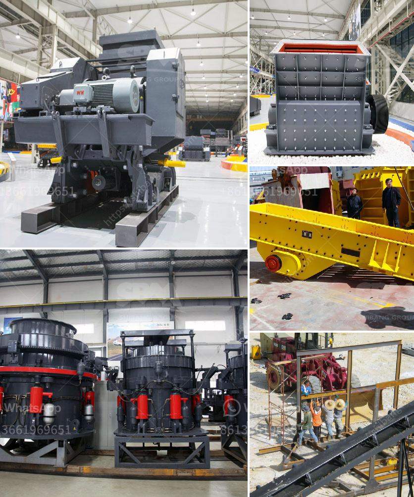

<h3>stone crusher for sale in uae</h3>
Stone crushing industry is an important industrial sector in the country, which produce different size crushed stone for various construction activities such as construction of roads, highways, bridges, buildings, canals etc. Stone crushers normally make use of a large variety of equipment like crushers, screeners, loaders, dumpers, etc. Stone crushers are primarily used for crushing different types of materials like limestone, granite, basalt, andesite, etc.

Traditionally, these stone crushers are found in quarries where they are used to crush enormous stones into smaller sized stones or aggregate for various construction purposes. These quarrying activities are carried out manually or using large machinery for high production rates. Currently, quarries are experiencing a scarcity of natural rocks suitable for construction, thus there is increasing demand for manufactured sand and crushed stones.

UAE, being one of the top destinations for the same, has an enormous demand for stone crushers and other mining equipment. Many companies operating in this field obtain both new and used stone crushers and other equipment due to the increasing demand in the market since 2016. With the increasing demand for aggregates, there is also a rising trend for crushers with higher output capacities, as well as a shift towards mobile crushers that allow for easy relocation and greater flexibility.

There are several types of stone crushers available in the market, including jaw crushers, cone crushers, impact crushers, and reversible impact crushers. These crushers are used to break rocks into smaller sizes, reduce large rocks or gravel into finer materials, or even pulverize them to a fine powder. The choice of crusher depends on the desired end product quality, as well as the cost and infrastructure availability at the quarry site.

When it comes to purchasing stone crushers in UAE, there are several factors to consider, including the brand, model, condition, and price of the equipment. Brand reputation is important to ensure that the equipment is of high quality and reliable. It is recommended to choose well-known brands that have been in the market for a long time and have a good track record.

Another important factor to consider is the model and capacity of the crusher. The model should be chosen based on the desired output capacity and the type of material to be crushed. For instance, jaw crushers are suitable for primary crushing of hard stones, whereas cone crushers are ideal for secondary or tertiary crushing applications.

The condition of the equipment is crucial as it affects the performance and lifespan of the crusher. It is recommended to inspect the equipment thoroughly before making a purchase. The price of the equipment is also an important consideration, and it is advisable to compare prices from different suppliers to get the best deal.

Overall, stone crushers are in high demand in UAE due to the increasing infrastructure projects and development in the country. Whether it is for construction of roads, highways, or buildings, stone crushers play a crucial role in providing the required materials. Therefore, individuals or companies looking to purchase stone crushers in UAE should carefully evaluate their requirements and make an informed decision considering various factors mentioned above.
<h3>Contact us</h3><ul><li><strong>Whatsapp:&nbsp;<a href="https://wa.me/8613661969651">+8613661969651</a></strong></li><li><a href="https://swt.shibang-china.com/?git&amp;zhl&amp;stone crusher for sale in uae"><strong>Online Service(chat now)</strong></a></li></ul><h3>Related</h3><ul><li><a href='dolomite powder plant.md'>dolomite powder plant</a></li><li><a href='silica sand production using ball mill in dubai.md'>silica sand production using ball mill in dubai</a></li><li><a href='enquiry about stone crusher.md'>enquiry about stone crusher</a></li><li><a href='mining processing machine prices.md'>mining processing machine prices</a></li><li><a href='ball mill construction.md'>ball mill construction</a></li></ul>