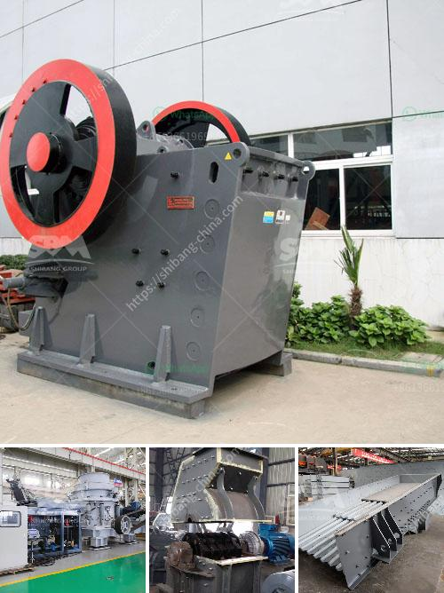

<h3>stone crusher from china</h3>
Stone Crusher from China: A Stone Crusher is a machine designed to reduce large rocks into smaller rocks, gravel, or rock dust. Crushers may be used to reduce the size, or change the form, of waste materials so they can be more easily disposed of or recycled, or to reduce the size of a solid mix of raw materials (as in rock ore), so that pieces of different composition can be differentiated. Crushing is the process of transferring a force amplified by mechanical advantage through a material made of molecules that bond together more strongly, and resist deformation more, than those in the material being crushed do.

A Stone Crusher from China is a machine that is specially developed to break large rocks into smaller fragments. Typically, crushing stages are followed by milling stages if the materials need to be further reduced. Stone Crushers are widely used in various industries including mining, construction, road and railway building, smelting, and much more.

One of the most renowned Stone Crusher Manufacturers in China, Zhengzhou Great Wall Heavy Industry Machinery Co., Ltd, has been engaging in the design and production of various types of stone crushers for over 30 years. Currently, their products include Primary Jaw Crushers, Secondary Jaw Crushers, Impact Crushers, Cone Crushers, Hydraulic Cone Crushers, Spring Cone Crushers, Hammer Crushers, Roll Crushers, Tertiary Crushers, Vibrating Screens, Belt Conveyors, etc.

The Stone Crusher machines from China have found immense application in various mineral ore, constructional, and chemical industries. Their applications are vast and diverse, which makes them vastly useful and immensely popular. These machines have made the work of numerous industries much easier and faster. The stone crushing industry in China has been growing rapidly due to increasing demand from the construction sector and the increasing investment in infrastructure development.

The stone crushing machines from China have been designed to crush a wide variety of stones with hardness levels ranging from soft to hard. They primarily crush different types of mineral ores, including iron ore, granite, limestone, quartzite, sandstone, cobblestone and many others. In addition, these machines have the capability to crush rocks into different sizes, such as 0-5mm, 5-20mm, 20-40mm, etc.

One of the main advantages of the Stone Crushers from China is that they can be easily transported to different locations to process different types of stone materials. This saves both time and money, as it eliminates the need for expensive transportation of raw materials. Furthermore, the Stone Crusher machines from China are designed to be energy efficient and environmentally friendly. They consume less energy during operation, reduce CO2 emissions, and are equipped with efficient dust suppression systems, which helps in maintaining a clean and healthy working environment.

In conclusion, Stone Crushers from China have been playing a crucial role in the construction industry. They have provided the necessary raw materials for various construction projects, as well as accelerating the economic development of China. With continuous advancements in technology, Stone Crushers are becoming more efficient and advanced, making them even more productive and reliable. Additionally, the high quality and durability of these machines ensure a long lifespan, reducing the need for frequent maintenance and replacement. Overall, the Stone Crushers from China are indispensable machines in the construction industry, and their popularity continues to grow.
<h3>Contact us</h3><ul><li><strong>Whatsapp:&nbsp;<a href="https://wa.me/8613661969651">+8613661969651</a></strong></li><li><a href="https://swt.shibang-china.com/?git&amp;zhl&amp;stone crusher from china"><strong>Online Service(chat now)</strong></a></li></ul><h3>Related</h3><ul><li><a href='large quarry machine manufacturers.md'>large quarry machine manufacturers</a></li><li><a href='grinding ball mills type p500.md'>grinding ball mills type p500</a></li><li><a href='beneficiation plant process line diagram.md'>beneficiation plant process line diagram</a></li><li><a href='rock crusher unit.md'>rock crusher unit</a></li><li><a href='hot used trommel screen machine in sand.md'>hot used trommel screen machine in sand</a></li></ul>