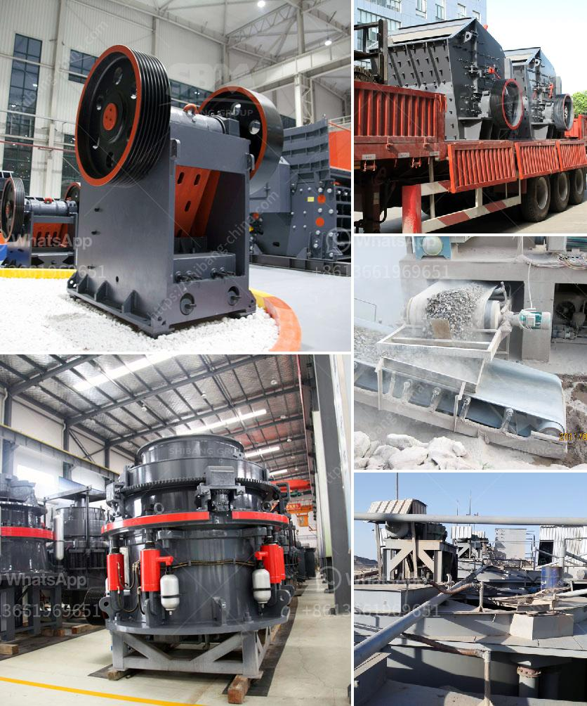

<h3>stone crusher in egypt</h3>
Stone crushing has always been an essential part of construction activities. Egypt has been a historical country with a rich history of building structures dating back to ancient times. Therefore, it comes as no surprise that stone crushing in Egypt is a vital sector in the economy, contributing to the nation's GDP.

Egypt's geographical location in northeastern Africa has played a pivotal role in its development. The country has been a hub for trading and has served as a crossroad between different civilizations. As a result, Egypt boasts a diverse range of architectural styles, with different stone materials used throughout history. From the pyramids of Giza, built with limestone, to the temples of Luxor, made from sandstone, stone has been a prominent building material.

The stone crusher industry in Egypt is essential for the efficient production of crushed stone, gravel, and sand, which is a vital material for several construction sectors, including buildings, roads, bridges, railways, and ports. While the industry is diverse in terms of products and uses, crushed stone production plays a crucial role in Egypt's economic development.

Stone crusher machines are widely used in the mining industry, construction materials, metallurgy, chemical industry, and other industries to crush various types of stones and rocks. They are commonly used in quarries for the production of gravel, crushed rock, quarry dust, sandy materials, and recycled materials.

Stone crushers work by breaking down large rocks and stones into smaller, more manageable sizes. They use a combination of mechanical forces, such as impact, compression, and attrition, to achieve the desired size reduction. Depending on the application, different types of crushers, such as jaw crushers, impact crushers, cone crushers, and hammer crushers, are used.

In Egypt, stone crushing has been a popular occupation for different generations. Crushing stones is considered one of the oldest and most prestigious industries in the country. Since ancient times, people used manual tools, but now they are using advanced machinery to perform their duties.

The stone crushing industry in Egypt has been growing rapidly due to the increasing demand for construction materials along with infrastructure development. The Prominent Players in the market include Puzzolana Machinery Fabricators LLP, DSMAC, IROCK Crushers, McLanahan, Rigaku Corporation, TechSmith Corporation, and Terex Corporation, among others.

Environmental concerns about the stone crushing industry have been a hot topic in recent years. The extraction and processing of rocks and stones may result in significant environmental impacts. Dust, noise, and vibrations can affect the health of workers and nearby communities. Moreover, the release of particulate matter is another concern.

To address these concerns, the Egyptian government and stone crushing companies have been taking various measures to mitigate the environmental impact. They have implemented dust suppression systems, water sprinklers, and green belts around the crusher sites. Additionally, regular monitoring and inspections are conducted to ensure compliance with environmental regulations.

In conclusion, stone crushing in Egypt is an economically significant sector that contributes to the country's construction industry and GDP. It plays a crucial role in supplying the necessary materials for infrastructure development. However, it is essential to approach it sustainably, considering the environmental impacts and taking proper measures to mitigate them. By doing so, stone crushing can continue to thrive while safeguarding Egypt's natural resources and communities.
<h3>Contact us</h3><ul><li><strong>Whatsapp:&nbsp;<a href="https://wa.me/8613661969651">+8613661969651</a></strong></li><li><a href="https://swt.shibang-china.com/?git&amp;zhl&amp;stone crusher in egypt"><strong>Online Service(chat now)</strong></a></li></ul><h3>Related</h3><ul><li><a href='hammer crusher china.md'>hammer crusher china</a></li><li><a href='stone crusher contact.md'>stone crusher contact</a></li><li><a href='nigeria vertical mill machine.md'>nigeria vertical mill machine</a></li><li><a href='mobile jaw crusher for sale india used price.md'>mobile jaw crusher for sale india used price</a></li><li><a href='hgm micro powder grinding mill.md'>hgm micro powder grinding mill</a></li></ul>