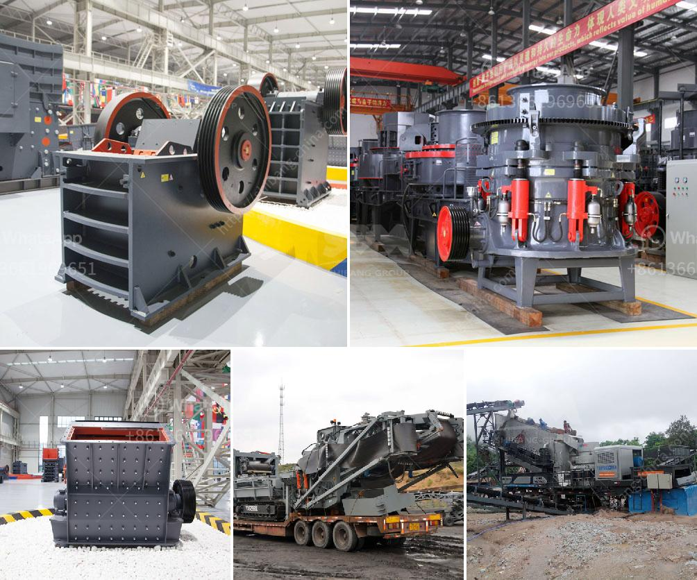

<h3>stone crusher machine crusher</h3>
Stone Crusher Machine: A crusher is a machine designed to reduce large rocks into smaller rocks, gravel, or rock dust. Crushers may be used to reduce the size, or change the form, of waste materials so they can be more easily disposed of or recycled, or to reduce the size of a solid mix of raw materials (such as in rock ore), so that pieces of different composition can be differentiated.

Crushing is the process of transferring a force amplified by mechanical advantage through a material made of molecules that bond together more strongly, and resist deformation more, than those in the material being crushed do. Crushing devices hold material between two parallel or tangent solid surfaces, and apply sufficient force to bring the surfaces together to generate enough energy within the material being crushed so that its molecules separate from (fracturing), or change alignment in relation to (deformation), each other. In essence, crushers are used for crushing stones and rocks into smaller sizes for various applications.

A stone crusher machine is built to reduce large rocks into smaller rocks, rock dust, or gravel. Stone crusher machine is widely known as Crushers, and they are used to reduce the size, change the form of waste minerals so they can easily be recycled or disposed of properly. Crusher is one of the primary machines to be used in the mining industry. It has a versatile ability to combine different crushing chambers, such as a coarse crushing chamber, medium crushing chamber, and fine crushing chamber.

Crusher machines are widely used in mining, stone crushing, metallurgy, construction, highway, railroad, and chemical industries. These machines are specifically designed to break down the large rocks into smaller stones or gravel. Some of the stone crushers machines are Jaw Crusher, Vibrating Screen, Cone Crusher, Impact Crusher, Hammer Mill, and Ball Mill.

1. Jaw Crusher: Jaw Crusher is a stone crushing machine that is widely used in mining, building materials, chemical industries, metallurgy and so on. It is designed to crush large rocks into small rocks or gravel and it can be used for various materials, such as limestone, granite, concrete, clinker, stone, etc.

2. Vibrating Screen: It is a widely used screening equipment that performs circular vibrations, which allows the screening of the various sizes of stones. It is commonly used in the mining industry where it separates materials based on size and removes unwanted impurities.

3. Cone Crusher: Cone Crusher is another type of stone crusher machine that is commonly used in mining, quarry, and material handling operations. This crusher is designed in such a way that it is either a stationary or portable machine.

4. Impact Crusher: Impact Crusher is another stone crushing machine that utilizes the striking force of the blow bars. They can be used in all sorts of rock material as the impact crushing principle allows for crushing even the hardest materials types, such as granite, basalt, and river rock.

5. Hammer Mill: Hammer mills are only used for medium to hard materials. Examples of the materials that can be crushed are coal, limestone, ores, and others. This machine requires many hammers and it is a complex structure, where each hammer is fitted with stiffeners so that it remains securely in place. They can vary in size from small grain crushers to heavy-duty machines.

6. Ball Mill: Ball mill is a type of stone crusher machine used to grind materials into an extremely fine powder, mainly used in the mineral processing industry. Ball mills can grind various ores and other materials either wet or dry, depending on requirements.

In conclusion, the stone crusher machine adds significant value to different applications and allows for easy disposal or recycling of waste materials. Its versatile design enables it to be used in a variety of industries, from mining to construction and even food processing. With the continuous development of technology and advancements, there is no doubt that the stone crusher machine will continue to play a crucial role in future industrial applications.
<h3>Contact us</h3><ul><li><strong>Whatsapp:&nbsp;<a href="https://wa.me/8613661969651">+8613661969651</a></strong></li><li><a href="https://swt.shibang-china.com/?git&amp;zhl&amp;stone crusher machine crusher"><strong>Online Service(chat now)</strong></a></li></ul><h3>Related</h3><ul><li><a href='jaw crusher 24x12 price.md'>jaw crusher 24x12 price</a></li><li><a href='two roll mill roller price.md'>two roll mill roller price</a></li><li><a href='recycled crushed concrete 20mm.md'>recycled crushed concrete 20mm</a></li><li><a href='iron ore vibrator screen.md'>iron ore vibrator screen</a></li><li><a href='china grove roller mill.md'>china grove roller mill</a></li></ul>