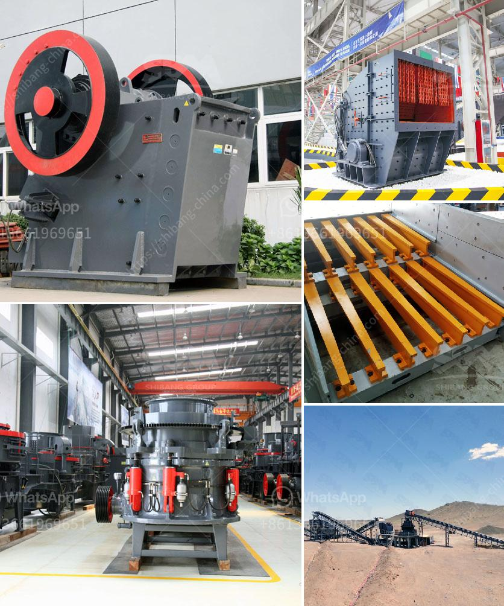

<h3>stone crusher machine of 150 tonnes price</h3>
Stone crusher machine is a vital equipment in the mining industry. The machine plays a major role in processing crushed stones into smaller pieces, which are used in various construction and road projects. The machine is also known as a rock crusher or an impact crusher, as it reduces the size of the stones through intense repeated collisions between the hammer-like pieces and the stones.

A stone crusher machine of 150 tonnes refers to the capacity of the machine, which can crush up to 150 tonnes of stones per hour. This machine is commonly used in construction projects for crushing large rocks into smaller pieces. The machine has a hydraulic system that ensures easy and smooth operation.

The price of a stone crusher machine of 150 tonnes varies widely depending on several factors. Some of the factors that influence the price include the brand reputation, machine specifications, country of origin, and additional features included. Generally, the cost ranges from $10,000 to $300,000.

Investing in a stone crusher machine of 150 tonnes comes with several advantages. Firstly, it increases the efficiency of your crushing operations. The machine can crush a large volume of stones in a short period, saving you time and labor costs. Secondly, it ensures consistent and high-quality crushed stones, which are essential for construction projects.

When buying a stone crusher machine, it is crucial to consider the after-sales services provided by the manufacturer or supplier. This includes warranties, spare parts availability, and technical support. It is also advisable to compare prices and specifications from different suppliers to ensure you get the best deal.

In conclusion, a stone crusher machine of 150 tonnes is a significant investment that can enhance productivity and efficiency in your construction projects. Research and consideration are essential to finding the right machine at the best price.
<h3>Contact us</h3><ul><li><strong>Whatsapp:&nbsp;<a href="https://wa.me/8613661969651">+8613661969651</a></strong></li><li><a href="https://swt.shibang-china.com/?git&amp;zhl&amp;stone crusher machine of 150 tonnes price"><strong>Online Service(chat now)</strong></a></li></ul><h3>Related</h3><ul><li><a href='iron crusher supplier.md'>iron crusher supplier</a></li><li><a href='hammer mill dealer in cebu.md'>hammer mill dealer in cebu</a></li><li><a href='grinding machine for bentonite.md'>grinding machine for bentonite</a></li><li><a href='type of crushers.md'>type of crushers</a></li><li><a href='overland conveyor belt system cost estimates.md'>overland conveyor belt system cost estimates</a></li></ul>