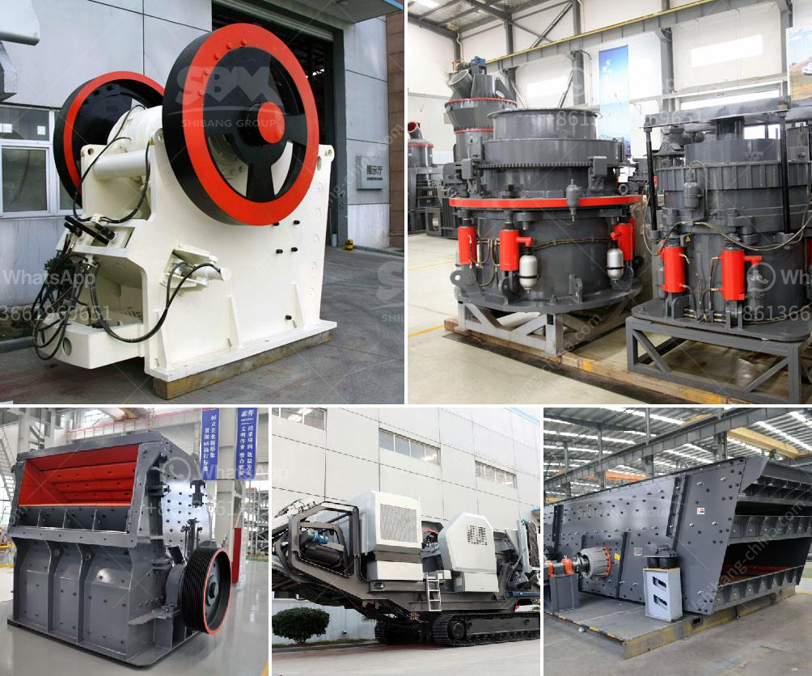

<h3>stone crusher machine philippines</h3>
Stone crusher machine is widely used in various industries such as mining, smelting, building materials, highways, railways, water conservancy, and chemical industries. With the continuous development of the Philippines economy, more and more industries are developing rapidly, leading to the vigorous development of the stone crusher machine market in the Philippines.

Stone crusher machine is widely used in the Philippines as crushing equipment. It is produced by a large number of equipment manufacturers, such as Zhengzhou Dingli, which specializes in the production of various types of crushing equipment! Our equipment can crush hard and soft stones into different sizes, as required by customers.

The Philippines is a mainly mountainous country. It has rich resources of marble, clays, graphite, and phosphate, which can be used for manufacturing various products. In addition, the country also has abundant limestone resources, making it one of the important markets for stone crushing equipment.

Currently, the Philippine government supports the development of infrastructure construction and encourages the mining and construction industries to invest in the Philippines. Therefore, the stone crusher machine industry is also developing rapidly. There are a wide range of stone crushers on the Philippine market, ranging from jaw crushers, impact crushers, cone crushers, hammer crushers and so on. These different stone crusher machines have their own characteristics and specifications, so customers should choose the needed crushers according to their actual situation.

The price of stone crusher machine in the Philippines is influenced by various factors, such as the brand, quality, etc. As the leading manufacturer and supplier of stone crusher machine in the Philippines, we have established a complete set of comprehensive after-sales service system to provide customers with comprehensive, fast, active and timely quality services. Our stone crusher machine has been exported to over 90 countries, such as the Philippines, Pakistan, Indonesia, Nigeria, Kenya, Tanzania, Ethiopia, Nepal, etc.

If you are still confused about the stone crusher machine price in the Philippines, you can consult us at any time. We provide 24/7 online service, and every inquiry will be answered promptly and professionally. This is the best choice for you to invest in stone crusher in the Philippines.
<h3>Contact us</h3><ul><li><strong>Whatsapp:&nbsp;<a href="https://wa.me/8613661969651">+8613661969651</a></strong></li><li><a href="https://swt.shibang-china.com/?git&amp;zhl&amp;stone crusher machine philippines"><strong>Online Service(chat now)</strong></a></li></ul><h3>Related</h3><ul><li><a href='cost of crushing plants in india.md'>cost of crushing plants in india</a></li><li><a href='small ball mill price.md'>small ball mill price</a></li><li><a href='stone for stone mill.md'>stone for stone mill</a></li><li><a href='cost of glass aggregate machines.md'>cost of glass aggregate machines</a></li><li><a href='china raymond mill company.md'>china raymond mill company</a></li></ul>