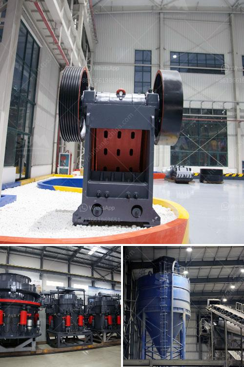

<h3>stone crusher machine rentals in ghana</h3>
Stone crusher machine rentals in Ghana are provided by the corporate mining equipment supplier SBM. The stone crushers on the rented machines are highly efficient and have great production rates. The machines are compact and easy to transport so they are able to be easily deployed on construction sites across Ghana. Whether you’re an experienced contractor or a first-time builder, owning a rock crusher or renting one for your project can be a game-changer for your work.

One advantage of our rental services is the ability to access a wide range of stone crushers on different rental plans. Whether you want a short-term rental or a long-term commitment, we have options that suit your needs. Looking for a machine to tackle a specific job? We have different sizes and models available for various crushing applications.

Renting a stone crusher machine in Ghana comes with several benefits. The machine not only saves time but it also saves huge labor costs. You don’t need a big team to operate it; one person can handle the entire crushing process. This also translates into a smaller workforce, allowing you to save money in terms of salaries and wages. Maintenance and repair costs are significantly reduced as well since there is no need to invest in specialized equipment or hire additional personnel for maintenance.

Moreover, renting a stone crusher machine also gives you the flexibility to use different tools and attachments with the equipment to make the job more efficient. For example, our crushers can be fitted with a magnet or a dust suppression system for cleaner and safer operations. Our crushers are easy to operate and require minimum training, making it possible to quickly adapt to different types of projects.

In conclusion, stone crusher machine rentals in Ghana have proven to be a smart investments for individuals, corporations, and construction companies. Land acquisition, excavation, extraction, crushing, screening, and washing equipment are necessary in addition to trucks for hauling materials. SBM provides businesses with essential equipment and machinery to carry out their operations efficiently.
<h3>Contact us</h3><ul><li><strong>Whatsapp:&nbsp;<a href="https://wa.me/8613661969651">+8613661969651</a></strong></li><li><a href="https://swt.shibang-china.com/?git&amp;zhl&amp;stone crusher machine rentals in ghana"><strong>Online Service(chat now)</strong></a></li></ul><h3>Related</h3><ul><li><a href='coal crusher machine manufacturers.md'>coal crusher machine manufacturers</a></li><li><a href='used quarry equipment for sale in calgary canada.md'>used quarry equipment for sale in calgary canada</a></li><li><a href='cost of setting a sand crushing plant in india.md'>cost of setting a sand crushing plant in india</a></li><li><a href='sand crusher machine.md'>sand crusher machine</a></li><li><a href='crusher machine suppliers.md'>crusher machine suppliers</a></li></ul>