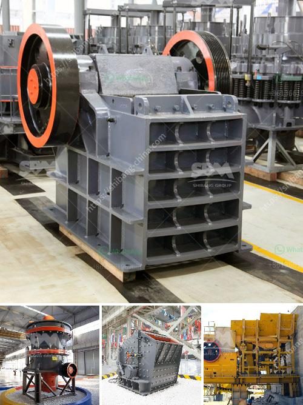

<h3>stone crusher machine usato in italy</h3>
Stone crushing machine usato in italy, or equipment for the crushing of stone, is commonly used in the construction industry and is used for multiple purposes. For instance, a crushing machine usato in many construction processes, such as highways, railroad tracks, bridges, buildings, canals, highways, and so on. Furthermore, it is also commonly used in the mining industry where it is utilized to break down larger rocks into smaller, more manageable sizes. In Italy, there are many manufacturers and suppliers of stone crushing machinery, which provides an array of options for users to choose from.

The stone crusher machine usato in Italy is designed to work on multiple construction sites and is suitable for the crushing of stones and rock of various nature and hardness. With the presence of heavy duty jaws and hydraulic technology, the machine allows for efficient crushing of large-sized rocks. Another notable feature of the crusher machine usato in Italy is the presence of anti-friction materials that greatly reduce the chances of wear and tear during operations.

One of the key benefits of opting for a stone crusher machine usato in Italy is the guaranteed quality of each machine. All machines are built to undergo detailed quality checks to ensure compliance with the required standards. In addition, they are also designed to be durable and reliable, which minimizes breakdowns and reduces the need for frequent maintenance.

The stone crushing machines usato in Italy also come with advanced features, making them highly efficient and cost-effective. For instance, the stone crusher machine usato in Italy can be equipped with advanced electronic control system that automatically adjusts the feeding speed and other crucial parameters. This enables the machine to optimize its performance, thereby reducing production costs and enhancing overall efficiency. Moreover, the machines are also equipped with specialized technologies such as automatic lubrication systems, which ensure proper lubrication of moving parts, thereby extending their lifespan.

Furthermore, stone crushing machines usato in Italy are also environmentally friendly. They are designed to minimize the emission of dust and other harmful particles into the air, making them ideal for use in urban areas and other environmentally sensitive locations. Additionally, the machines also feature noise reduction technologies that minimize noise pollution during operations.

In conclusion, stone crushing machines usato in Italy are essential equipment for the construction and mining industries. They are built with advanced features and are designed to be robust, reliable, and efficient. The machines are suitable for the crushing of various types of stones and rocks and come with advanced electronic control systems that optimize their performance. Moreover, they are also environmentally friendly and feature noise reduction technologies. Overall, stone crushing machines usato in Italy provide an excellent solution for contractors and miners who require high-quality, efficient, and reliable crushing machinery.
<h3>Contact us</h3><ul><li><strong>Whatsapp:&nbsp;<a href="https://wa.me/8613661969651">+8613661969651</a></strong></li><li><a href="https://swt.shibang-china.com/?git&amp;zhl&amp;stone crusher machine usato in italy"><strong>Online Service(chat now)</strong></a></li></ul><h3>Related</h3><ul><li><a href='components of the hammer crusher.md'>components of the hammer crusher</a></li><li><a href='trommel wash plant suppliers pakistan.md'>trommel wash plant suppliers pakistan</a></li><li><a href='lm series vertical mill.md'>lm series vertical mill</a></li><li><a href='gypsum production in visakhapatnam.md'>gypsum production in visakhapatnam</a></li><li><a href='cone crusher zenith.md'>cone crusher zenith</a></li></ul>