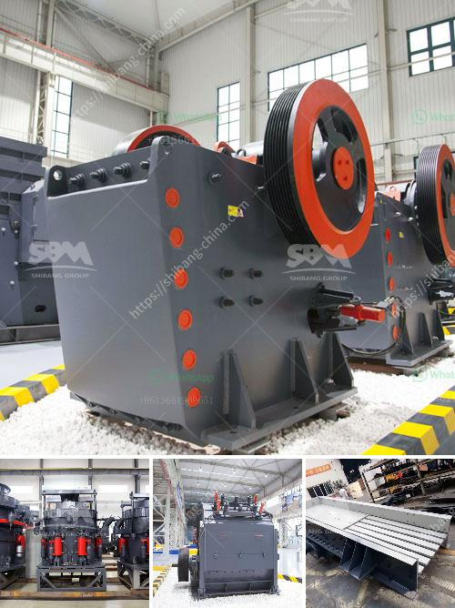

<h3>stone crusher machines ebay</h3>
Stone crusher machines are widely used in the mining industry, construction materials industry, and metallurgy industry for crushing various raw materials. In the mining industry, these machines are used to break down large rocks into smaller, more manageable sizes. The stone crusher machines on eBay are often used for miscellaneous projects, such as construction of roads, bridges, buildings, and mining industries.

Used stone crushers are selected as asbestos crusher machines. Asbestos ore is a general name that applies to several types of fibrous silicate minerals. It is abundant in Brazil, Canada, China, Kazakhstan, Russia, South Africa, Zimbabwe, in particular Russia’s Urals and Quebec of Canada, which are the richest regions of asbestos reserves in the world. Nowadays, there are many different types of building materials crushers in the market, such as jaw crusher, cone crusher, impact crusher, hammer crusher and so on. They all have their own advantages and disadvantages. But a good crusher can greatly improve the the utilization rate of building materials and also improve our work efficiency.

Stone crusher machines not only have high quality, but also have various types. Many models and selective equipment give customers more choices. SBM produced wheeled crusher (mobile crusher) of a rough introduction. Used for primary crushing, concrete and waste recycling, processing of construction waste, quarry, coal-mining industry, and more. The secondary wheel mobile impact crusher can process materials on the spot and the overall performance is extremely portable. SBM Wheeled mobile impact crusher can be applied to co, glass, expressway, artificial sand, and more. They can work with various kinds of materials with different hardness levels.

Stone crusher machine eBay has been the most popular type of stone crushers in the world and they all have their own advantages and disadvantages. But a good crusher can greatly improve the the utilization rate of building materials and also improve our work efficiency. Today I will introduce a new type high efficiency crusher—PFW impact crusher. PFW impact crusher is a promising crushing equipment. Gravel producers can customize various type stone crusher respectively according to their different requirements. SBM provides stone crushing machine and screening equipments for various industries such as mining, building materials, metallurgy, environmental protection, transportation, chemistry, energy and so on.

Overall, the stone crusher machines on eBay have a good overall performance and high reliability in the mining industry. Many customers have been very satisfied with their stone crushing machines. As a reputable manufacturer on this platform, they strive to provide quality products and at a reasonable price. They offer a variety of models for you to choose from, ranging from small stone crushers to large machines. They also have different specifications and usage requirements, so you can choose according to your needs. You can trust in their products and rely on their reliable customer service. Whether it is pre-sales, sales, or after-sales, they will serve you wholeheartedly.
<h3>Contact us</h3><ul><li><strong>Whatsapp:&nbsp;<a href="https://wa.me/8613661969651">+8613661969651</a></strong></li><li><a href="https://swt.shibang-china.com/?git&amp;zhl&amp;stone crusher machines ebay"><strong>Online Service(chat now)</strong></a></li></ul><h3>Related</h3><ul><li><a href='impact coal crusher.md'>impact coal crusher</a></li><li><a href='limestone crushing machines.md'>limestone crushing machines</a></li><li><a href='sand washing plant process.md'>sand washing plant process</a></li><li><a href='stamp mill machine south africa.md'>stamp mill machine south africa</a></li><li><a href='crusher for sale philippines.md'>crusher for sale philippines</a></li></ul>