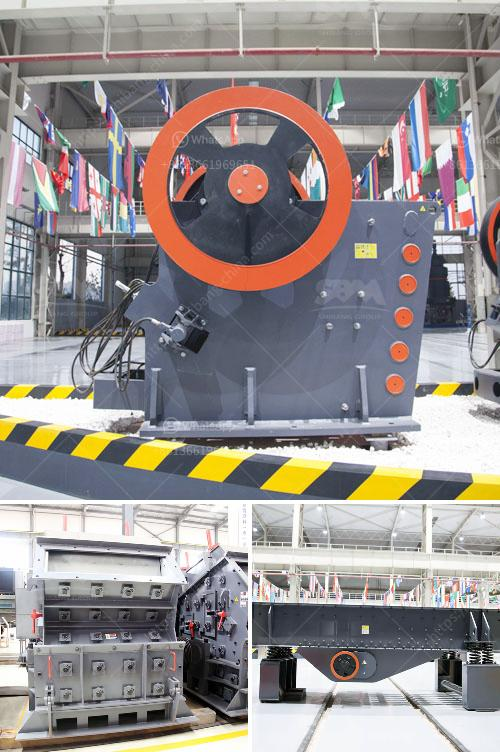

<h3>stone crusher manufacturers in india</h3>
Stone crushing industry is an important industrial sector in the country. The crushed stone is then used as raw material for various construction activities i.e. construction of roads, bridges, buildings and canals. Over the last 10 years, the Construction sector has been registering strong growth rates in the range of 7-8%. Consequently, the demand for crushed stone is expected to increase thereby accelerating growth for stone crusher manufacturers in India.

However, the emissions generated during the process of crushing stone causes significant environmental impacts. To mitigate these issues and reduce their environmental footprint, stone crusher manufacturers in India are stepping up their efforts towards sustainable development. In addition, the government is also aggressively promoting various initiatives such as Rural Roads Development, Urban Infrastructure Development, and Housing projects amongst others, to boost the construction industry.

The stone crusher market in India has grown extensively in the past few years. The growth is attributed to the increasing demand for stone crushers in the country due to the easy availability and relatively affordable prices of these machines. Additionally, government initiatives such as the Pradhan Mantri Awas Yojana Housing for All and the Smart City project have boosted the stone crushing market.

Leading stone crusher manufacturers in India are now focusing on technological advancements in their products to meet the changing needs of the nation. The Indian market for crushing and screening equipment is one of the most promising in the world. With the country’s expanding construction industry, the demand for stone crushers are constantly increasing. With the advancement in technology, the manufacturers are incorporating the latest automation systems into their products. These machines have become more user-friendly and productive, contributing to the overall development of the construction industry in India.

In conclusion, stone crusher manufacturers in India have a large market potential and bright future. With the increasing demand for stone crushers, the manufacturers are likely to accelerate their research and development efforts in the coming years to meet the growing demand. The industry participants are also investing in new manufacturing facilities to increase their production capacities and cater to the rising demand. As a result, the stone crusher manufacturers in India are expected to prosper and flourish in the years to come.
<h3>Contact us</h3><ul><li><strong>Whatsapp:&nbsp;<a href="https://wa.me/8613661969651">+8613661969651</a></strong></li><li><a href="https://swt.shibang-china.com/?git&amp;zhl&amp;stone crusher manufacturers in india"><strong>Online Service(chat now)</strong></a></li></ul><h3>Related</h3><ul><li><a href='vibrating screen size decision.md'>vibrating screen size decision</a></li><li><a href='tracked mobile screening plant.md'>tracked mobile screening plant</a></li><li><a href='how much does sand processing plant cost.md'>how much does sand processing plant cost</a></li><li><a href='marble powder plant.md'>marble powder plant</a></li><li><a href='agen jaw crusher kenya.md'>agen jaw crusher kenya</a></li></ul>