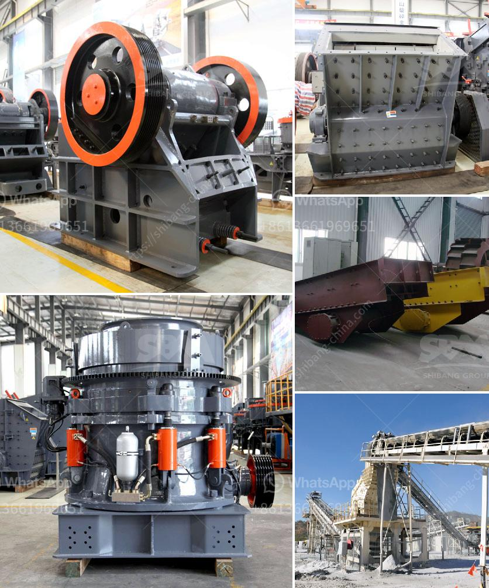

<h3>stone crusher mesin malaysia</h3>
In recent years, Malaysia has made significant advancements in construction and mining industries. The rise of Malaysia as a leading exporter of stone crusher machines has been noted by several international companies. With an increasing industry presence, Malaysia has become a favored destination for these machines.

There are several advantages associated with the use of stone crushing machines in the mining industry. For starters, they are highly efficient and can be easily transported to different worksites. The ability to process blocks of granite, basalt, limestone, and other naturally-occurring stones within minutes makes them indispensable equipment in the sector.

Another significant advantage of stone crushing machines is that they are available in different models, sizes, and capacities. This allows companies to choose the most suitable machine for their specific needs. Whether it is a small portable machine or a large crushing plant, there are options available.

Additionally, stone crushing machines are also flexible in terms of their deployment. They can be used for primary, secondary, or tertiary crushing, depending on the needs of the project. This versatility makes them an ideal choice for different construction and mining applications.

Malaysia is renowned for the extraction and production of natural stones. Construction and mining companies utilize stone crushers to break down stones into different sizes. In effect, these machines can be essential for efficient mining operations. Identifying the best supplier of stone crusher machines in Malaysia can be a daunting task without conducting prior research.

To assist companies to source for reliable suppliers, we have put together a list of the top stone crusher machine suppliers in Malaysia. For more information, please visit our website.

Fote Heavy Machinery is a renowned supplier of stone crushers in China. The company has been providing high-quality machines to customers for years now. Fote Heavy Machinery focuses on the production of jaw crushers, impact crushers, and cone crushers. With more than 30 years of experience, the company can produce crushing equipment of various capacities.

Zhongxin Heavy Industrial is another leading stone crusher machine manufacturer, with over 30 years of experience. With a focus on manufacturing mining crushing equipment, Zhongxin Heavy Industrial specializes in the production of stone crushers, including cone crushers, jaw crushers, and impact crushers.

Over the years, Malaysia has established itself as a leading exporter of stone crusher machines to international markets. Several companies within the country are now ensuring production of these machines to meet the ever-increasing market demand. Whether for large or smaller-scale use, stone crusher machines ensure efficient mining operations as well as provide versatility for various construction projects.
<h3>Contact us</h3><ul><li><strong>Whatsapp:&nbsp;<a href="https://wa.me/8613661969651">+8613661969651</a></strong></li><li><a href="https://swt.shibang-china.com/?git&amp;zhl&amp;stone crusher mesin malaysia"><strong>Online Service(chat now)</strong></a></li></ul><h3>Related</h3><ul><li><a href='impact crusher machine manufacturer.md'>impact crusher machine manufacturer</a></li><li><a href='talcum powder bp usp manufacturers in india.md'>talcum powder bp usp manufacturers in india</a></li><li><a href='jaw crusher and cone crusher manufacturers in dubai.md'>jaw crusher and cone crusher manufacturers in dubai</a></li><li><a href='cost of crushing plants in india.md'>cost of crushing plants in india</a></li><li><a href='ball mills sizes.md'>ball mills sizes</a></li></ul>