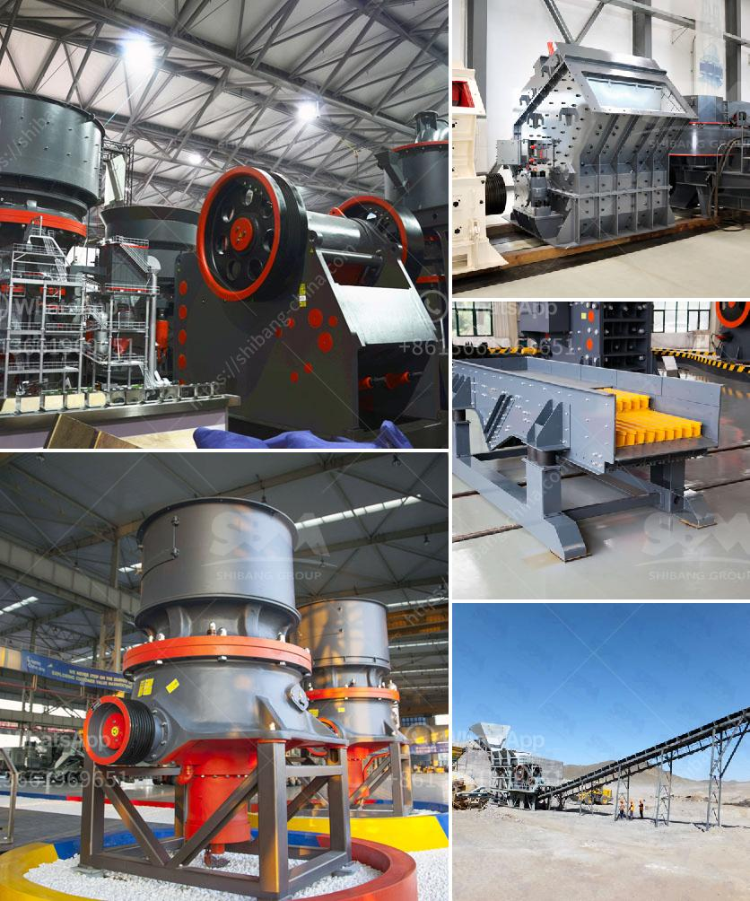

<h3>stone crusher mills in mercadolibre</h3>
Stone crusher mills have gained prominence in recent years in the mining industry. These mills are designed to handle large quantities of raw materials, crush them to a desired particle size, and separate impurities from the final product. They are essential equipment in various industries such as mining, construction, and transportation.

Mercadolibre, a popular online marketplace in many Latin American countries, provides a platform for sellers and buyers to connect. It offers a vast range of products and services, including stone crusher mills. The availability of these mills on Mercadolibre has made it easier for businesses and individuals to procure such equipment.

Stone crusher mills are versatile machines that can crush a variety of materials, such as limestone, granite, basalt, river gravel, and more. They are commonly used in the mining industry to reduce the size of ore blocks and facilitate further processing. These mills are also employed in construction projects to crush concrete and other building materials.

One of the primary advantages of stone crusher mills is their ability to produce uniform particles of varying sizes. This allows for consistent production and high-quality output, making them ideal for use in the construction and transportation sectors. Moreover, these mills can handle large quantities of raw materials efficiently, saving time and resources for businesses.

On Mercadolibre, stone crusher mills can be found in various sizes and configurations to suit the specific needs of different industries. They are available in both new and used conditions, providing options for businesses with different budget constraints. Additionally, sellers on Mercadolibre often offer competitive pricing, making it a cost-effective platform for procuring such equipment.

In conclusion, stone crusher mills available on Mercadolibre play a crucial role in various industries. Their ability to crush large quantities of raw materials efficiently and produce uniform particles make them indispensable in the mining, construction, and transportation sectors. With their availability on Mercadolibre, businesses and individuals can easily find and purchase these mills, ensuring a smooth and efficient production process.
<h3>Contact us</h3><ul><li><strong>Whatsapp:&nbsp;<a href="https://wa.me/8613661969651">+8613661969651</a></strong></li><li><a href="https://swt.shibang-china.com/?git&amp;zhl&amp;stone crusher mills in mercadolibre"><strong>Online Service(chat now)</strong></a></li></ul><h3>Related</h3><ul><li><a href='nigeria rock crusher for sale.md'>nigeria rock crusher for sale</a></li><li><a href='alluvial diamond processing plant container for sale.md'>alluvial diamond processing plant container for sale</a></li><li><a href='granite crushing plant for sale in south africa.md'>granite crushing plant for sale in south africa</a></li><li><a href='i am looking for a stone crusher in malaysia.md'>i am looking for a stone crusher in malaysia</a></li><li><a href='crushing plant design and layout considerations.md'>crushing plant design and layout considerations</a></li></ul>