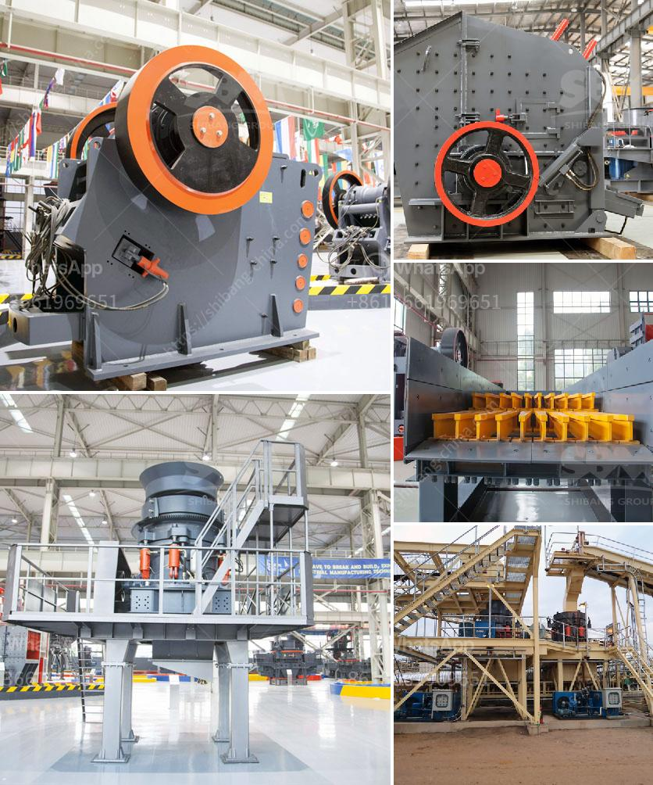

<h3>stone crusher plant cost in saudi</h3>
The construction industry is the third largest industry in Saudi Arabia. It plays a vital role in the kingdom's economy as it employs more than two million workers and contributes to various sectors such as infrastructure, housing, transportation, and water resources development. Therefore, the demand for stone crusher plants is surging in the region, especially in Saudi Arabia.

The kingdom of Saudi Arabia is categorized as a high-income economy, and it is the largest economy in the Middle East region. With the increasing demand for stone material in the construction industry, the stone crusher plant market in the country is growing. However, for new entrepreneurs, setting up a stone crusher plant may seem like a daunting task due to multiple factors.

The primary factor that affects the cost of the stone crusher plant in Saudi Arabia includes labor, equipment rental fees, and government permits. Government permits for the importation of construction materials, such as crushed stone, require a substantial investment. The cost of transporting materials into the country can also be significant.

Another important cost consideration is the availability and cost of labor. The construction industry in Saudi Arabia heavily relies on migrant workers, and there may be associated costs such as visa fees and worker accommodations. The availability of skilled labor can also impact the cost of setting up and operating a stone crusher plant.

Equipment rental fees can also be a significant expense when setting up a stone crusher plant. To keep costs under control, equipment rental is a common practice in the industry. However, it requires a labor force to operate the equipment, which can increase operational costs.

Despite the associated costs, setting up a stone crusher plant in Saudi Arabia is a great opportunity to invest in the booming construction industry. Whether it is for infrastructure, housing, or other sectors, investing in a stone crusher plant can be financially rewarding.

To ensure that the plant operates efficiently and generates the required revenue, entrepreneurs need to have a clear understanding of the market demand and competition. Conducting a comprehensive market study can help identify potential customers, supply chain dynamics, and pricing strategies.

Additionally, entrepreneurs should ensure an efficient business plan and financial management. This includes accurately estimating the initial investment, operating costs, and projected revenue. It is essential to have a detailed understanding of the costs associated with labor, equipment, permits, and transportation.

Moreover, acquiring the necessary licenses and permits is critical for a smooth operation. Entrepreneurs should familiarize themselves with the local regulations and work with legal experts to ensure compliance.

In conclusion, setting up a stone crusher plant in Saudi Arabia can be a challenging task, but it is a great opportunity for new entrepreneurs. With proper market research and planning, the potential for profit is promising. Understanding the costs associated with labor, equipment rental, and government permits is crucial for achieving success in this venture. By investing smartly and managing efficiently, entrepreneurs can tap into the thriving construction industry in Saudi Arabia.
<h3>Contact us</h3><ul><li><strong>Whatsapp:&nbsp;<a href="https://wa.me/8613661969651">+8613661969651</a></strong></li><li><a href="https://swt.shibang-china.com/?git&amp;zhl&amp;stone crusher plant cost in saudi"><strong>Online Service(chat now)</strong></a></li></ul><h3>Related</h3><ul><li><a href='small impact crusher 100 mesh.md'>small impact crusher 100 mesh</a></li><li><a href='quartz crusher plant cost.md'>quartz crusher plant cost</a></li><li><a href='250 tph mobile stone crusher price in india.md'>250 tph mobile stone crusher price in india</a></li><li><a href='sample business plan for gold mine.md'>sample business plan for gold mine</a></li><li><a href='crusher equipment supplier.md'>crusher equipment supplier</a></li></ul>