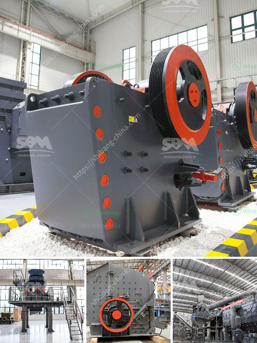

<h3>stone crusher plant for sale</h3>
Are you in the market for a new stone crusher plant for sale? Perhaps you are just starting out in the construction industry and are looking for a way to increase your output and capabilities. One option could be a stone crusher plant for sale. These plants are used to crush stones of varying sizes into smaller, more manageable pieces. The resulting materials can then be used in a variety of construction projects, such as concrete, asphalt, or road base.

When considering the purchase of a stone crusher plant for sale, there are a few key factors to consider. First, you need to determine the maximum feed size of the stones to be crushed. This will help you determine the size and capacity of the crusher plant, ensuring that it can handle the materials you need to process. Additionally, you should consider the desired output size of the crushed stones. Some plants offer adjustable settings to produce a variety of sizes, while others may be limited to a specific output size.

Another important factor to consider is the power source of the crusher plant. Many stone crusher plants are powered by diesel engines or electricity. Diesel engines are preferred in remote areas where a reliable power supply may not be available. On the other hand, if electricity is readily accessible, an electric-powered crusher plant may be more efficient and cost-effective in the long run.

It is also crucial to consider the durability and quality of the stone crusher plant for sale. Investing in a high-quality and reliable plant will ensure that it can withstand the demands of constant use and heavy-duty crushing. Look for a plant made with sturdy materials and designed to withstand harsh environmental conditions. Additionally, it is important to choose a plant from a reputable manufacturer known for their reliable and efficient equipment.

In conclusion, a stone crusher plant for sale can offer a valuable and versatile option for your construction business. It allows you to crush stones into smaller, more manageable pieces that can be used in a variety of construction projects. When purchasing a crusher plant, consider factors such as the maximum feed size, desired output size, power source, and the durability of the plant. By investing in a high-quality and reliable plant, you can ensure the success and efficiency of your construction projects.
<h3>Contact us</h3><ul><li><strong>Whatsapp:&nbsp;<a href="https://wa.me/8613661969651">+8613661969651</a></strong></li><li><a href="https://swt.shibang-china.com/?git&amp;zhl&amp;stone crusher plant for sale"><strong>Online Service(chat now)</strong></a></li></ul><h3>Related</h3><ul><li><a href='technical parametres of impact crusher.md'>technical parametres of impact crusher</a></li><li><a href='pebble crusher for sale.md'>pebble crusher for sale</a></li><li><a href='europe used grinding equipment.md'>europe used grinding equipment</a></li><li><a href='sample of a business proposal for a block factory.md'>sample of a business proposal for a block factory</a></li><li><a href='mtm raymond mill.md'>mtm raymond mill</a></li></ul>