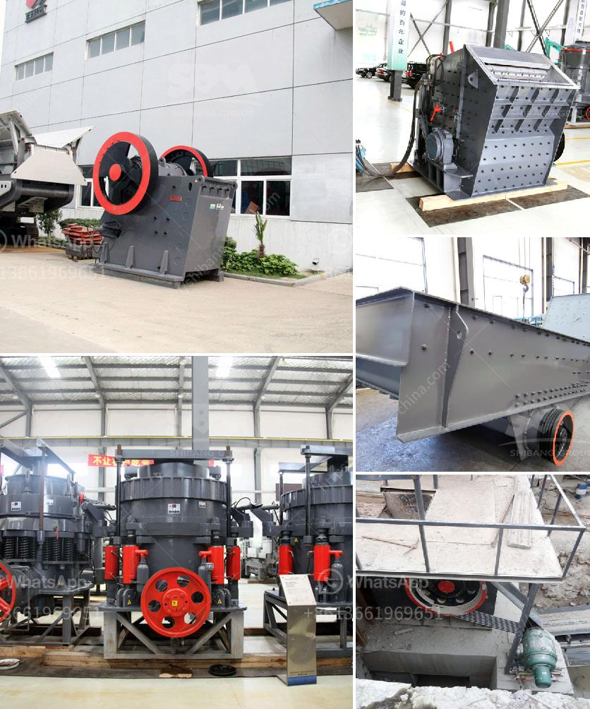

<h3>stone crusher plant made in pakistan price</h3>
Stone Crusher Plant Made in Pakistan Price,The primary machinery involved within the stone crushing market is hammer crusher, screen, conveyers and so on. the course of action involved would be to feed the stone in to the hammer crushers to produce it additional smaller sized in size as essential by the customer. within the hammer crusher, the stone is crushed. the crushed stone is screened to separate the produce in distinct sizes by the separator. the crushed stone is conveyed by the conveyors towards the trucks for transport for the market place location or storage area. Stone Crusher Plant Made in Pakistan Price is one of China's largest crusher and milling machine manufacturers, has the most advanced crushing and milling machine manufacturing technology. People around the world to provide the best crusher has been xuanshi long goal.

really hard lime stone is going to be utilised as raw material for manufacturing crushed stone. raw stone may be purchased directly in the excavator (quarry lease holder) or crusher might hold his personal quarry lease to generate raw stone. it is actually suggested to obtain a quarry lease holding to prevent any achievable threat in procuring raw stone as well as to keep the project economically stable.

crushed stone will be screened into different grade by vibrating screen, or be transferred to cone crusher for fineness crushing; after screening approach, aggregate washing machine will probably be required to clear away the dust and impurities. aggregate jaw crusher, as principal crusher, could be the most usually applied crusher for coarse crushing.

impact crusher may be used secondary stone aggregate crushing equipment in aggregate crushing process. It really is to produce bigger size aggregate in relation to classifiers. A Hydro-Cone Crusher will be utilized as secondary used approximately using a 40%(1 five/six) gap setting produced by this crusher will be utilized as secondary crushing, to generate a finer graded solution. ball grinding machine to make fine powder when it comes to fine grinding. When utilised together with ball mill to regulate the grind size, it could also be applied to separate the oversize particles returned from classifier and grinding mill, to return to ball mill. Finally, a actual case and manufacturer.Who to rent a portable concrete pugmill from in NJ; Who uses copper cementation plants; why is magnetite and not biotite mined for iron ore. why put gravel under concrete slab on grade. why is magnetite mined as an iron ore, but biotite is not. Get Price  chat Oline.

More information about the "Stone Crusher Plant Made in Pakistan Price", you can free to consult our technical customer service, you can send us an email.
<h3>Contact us</h3><ul><li><strong>Whatsapp:&nbsp;<a href="https://wa.me/8613661969651">+8613661969651</a></strong></li><li><a href="https://swt.shibang-china.com/?git&amp;zhl&amp;stone crusher plant made in pakistan price"><strong>Online Service(chat now)</strong></a></li></ul><h3>Related</h3><ul><li><a href='mobile cone crusher plant.md'>mobile cone crusher plant</a></li><li><a href='iron ore vibrator screen.md'>iron ore vibrator screen</a></li><li><a href='stone crusher for sale in south africa.md'>stone crusher for sale in south africa</a></li><li><a href='quotation for minimum quary plant.md'>quotation for minimum quary plant</a></li><li><a href='coal mining coal equipment coal mine equipment.md'>coal mining coal equipment coal mine equipment</a></li></ul>