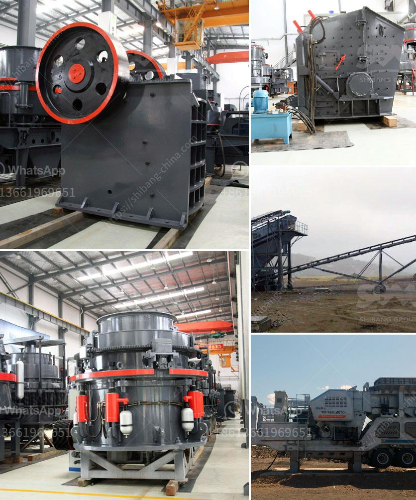

<h3>stone crusher plant minimum capacity price in india</h3>
Stone crusher plant minimum capacity price in India is determined by numerous factors, including the brand, size, capacity, production, and maintenance requirements. The selection of a crusher plant can be complex, as the task requires a careful examination of the various aspects that will determine its efficiency and profitability.

One of the main factors influencing the price of a stone crusher plant is its production capacity. Different capacity plants have varying levels of investment, and each requires a different level of operating and maintenance costs. It is crucial to consider both the current and future capacity needs of the operation, as it will directly impact the productivity and profitability.

The price of a stone crusher plant also depends on the brand and manufacturer. Quality and durability are essential when selecting a crusher plant, as it will affect the overall performance and longevity of the equipment. Established and reputable manufacturers often offer higher prices due to their commitment to providing reliable products.

The size and type of the stone being crushed will also impact the price. Harder and larger stones require more powerful machinery and specialized crushers, which can increase the cost. On the other hand, smaller, softer stones may require less robust equipment, making the plant more affordable.

The price of a stone crusher plant in India is influenced by the geographical location of the site. The cost of transportation from the quarry to the crusher plant and the distance from the crusher plant to the construction site will determine the expenses associated with the project. In some instances, the availability of raw materials may also affect the overall cost.

Maintenance requirements should not be overlooked when considering the price of a stone crusher plant. Regular maintenance and repairs are necessary to ensure optimal performance and avoid costly breakdowns. The cost of replacement parts and labor involved in maintenance should be factored into the overall budget.

It is recommended to research and compare multiple options before settling on a stone crusher plant. Comparing prices, specifications, and after-sales service can aid in making an informed decision. Additionally, consulting with industry experts and seeking recommendations from other professionals can provide valuable insights and ensure that the chosen plant meets all the requirements.

Investing in a stone crusher plant is a significant decision that will impact the long-term success of a business. Therefore, it is essential to carefully consider all the factors influencing the price and efficiency of the plant. By conducting thorough research, analyzing needs, and consulting professionals, businesses can make an educated decision while ensuring maximum productivity and profitability.
<h3>Contact us</h3><ul><li><strong>Whatsapp:&nbsp;<a href="https://wa.me/8613661969651">+8613661969651</a></strong></li><li><a href="https://swt.shibang-china.com/?git&amp;zhl&amp;stone crusher plant minimum capacity price in india"><strong>Online Service(chat now)</strong></a></li></ul><h3>Related</h3><ul><li><a href='cone crusher for sale in philippines.md'>cone crusher for sale in philippines</a></li><li><a href='stone crusher plant cost in saudi.md'>stone crusher plant cost in saudi</a></li><li><a href='sayaji stone crushers ahmedabad.md'>sayaji stone crushers ahmedabad</a></li><li><a href='coal mining coal equipment coal mine equipment.md'>coal mining coal equipment coal mine equipment</a></li><li><a href='mobile crushers stone in south africa.md'>mobile crushers stone in south africa</a></li></ul>