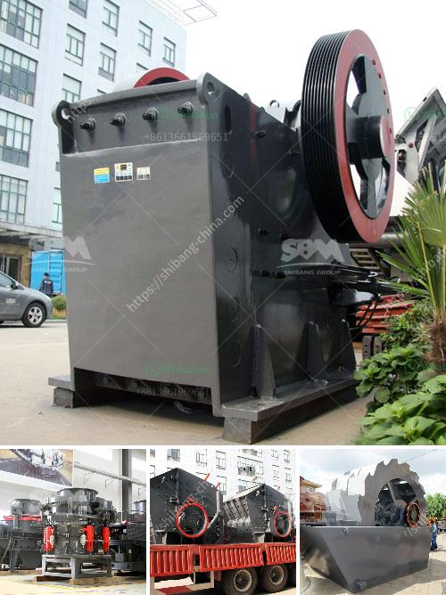

<h3>stone crusher plants</h3>
Stone crusher plant is a profitable venture for new entrepreneurs. The demand for quality stone chips is increasing day-by-day. Crushed stone aggregates are essential for the construction of roads, bridges, housing, industrial building construction, railway, highspeed railway, etc. In such a big market with brilliant future, a stone crusher plant is a profitable venture for new entrepreneurs.

However, in order to make the stone crushing plant a reality, many factors must be considered. First, investment capital and raw materials are the main factors that affect the plant's operating costs. A stone crusher plant needs sufficient funds to invest in the necessary equipment, and the high price of raw materials is also a difficult problem to solve.

Another factor that affects the profitability of the plant is the product quality. Good quality stone chips ensure smooth construction activities. Hence, the stone crusher plant must be designed in a way that produces high-quality end products. Further, the plant should be equipped with technologically advanced machinery to minimize the wastage of raw materials.

Moreover, the location of the stone crusher plant is also an important factor. If the location is near the construction site, it reduces transportation costs for carrying crushed stone chips to the construction site. This advantage can significantly increase the profitability of the plant.

Additionally, the stone crusher plant should be equipped with an effective dust collection system to prevent environmental pollution. The dust collection system plays a vital role in improving air quality near the crusher plant and reduces exposure to harmful airborne particles. Besides, stone crusher pollution control equipment for daily operation should also be available.

When it comes to managing the overall operation of a stone crusher plant, the plant owner must adhere to various regulations and rules. For example, the registration of the plant, obtaining necessary licenses and permits, and following all the safety guidelines and protocols provided by the local authorities are mandatory. Any negligence in meeting these requirements can lead to legal issues and penalties.

Furthermore, the stone crusher plant must have proper maintenance to ensure smooth operation. The operators and maintenance personnel should be trained properly to handle all the machinery and equipment. Regular inspection and maintenance should be performed to detect any potential issues and fix them promptly.

In conclusion, a stone crusher plant is a profitable venture for new entrepreneurs. However, proper planning, investment, product quality, location, and adherence to regulations are crucial factors that ultimately determine the success and profitability of the plant. With careful consideration and diligent management, a stone crusher plant can yield significant returns and contribute to the development of the construction industry.
<h3>Contact us</h3><ul><li><strong>Whatsapp:&nbsp;<a href="https://wa.me/8613661969651">+8613661969651</a></strong></li><li><a href="https://swt.shibang-china.com/?git&amp;zhl&amp;stone crusher plants"><strong>Online Service(chat now)</strong></a></li></ul><h3>Related</h3><ul><li><a href='used crusher machines from china.md'>used crusher machines from china</a></li><li><a href='stone crushers in ethiopia.md'>stone crushers in ethiopia</a></li><li><a href='mobile gold processing plant in russia.md'>mobile gold processing plant in russia</a></li><li><a href='materials for zenith jaw crusher in europe.md'>materials for zenith jaw crusher in europe</a></li><li><a href='vertical ball mills.md'>vertical ball mills</a></li></ul>