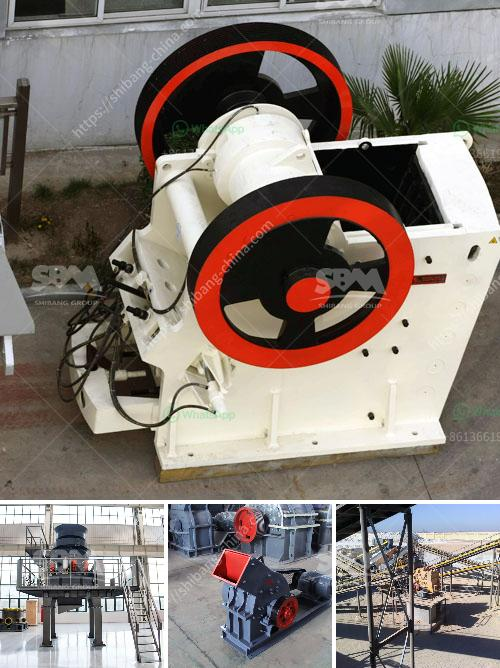

<h3>stone crusher price list 300 tonnes capacity per hour</h3>
The stone crusher price list 300 tonnes capacity per hour shows the price of stone crusher plant with different capacities for your reference. It is important to select the right size of crusher plant for different applications. Stone crushing industry is an important industrial sector in the country engaged in producing crushed stone of various sizes depending upon the requirement which acts as raw material for various construction activities such as construction of roads, highways, bridges, buildings, and canals etc.

The stone crusher price list 300 tonnes capacity per hour can crush medium hard rock types such as limestone as well as all rock-based recycled materials. The robust jaw crusher for hard rock applications is a primary crusher (PEW250*1200) with a capacity of 300-650 tonnes per hour. The smaller portable jaw crusher (PEW400*600) is landfill operators and concrete recycling operations.

With an aggressive crushing action and a high output even at tight settings, the Metrotrak is ideally suited for operators on the mining, quarrying and recycling industries. The Metrotrak HA offers hydraulic adjustment which offers users the benefit of quickly and easily changing the size of finished product. The robust, high-performance crusher features a large size jaw crusher with a huge feed opening to deliver outstanding productivity.

The Bison 280 is a compact track mobile jaw crusher featuring the 900mm x 600mm single toggle jaw crusher. This machine utilizes an extremely fuel efficient and powerful 'Direct Drive' system to power the crusher which provides excellent performance in recycling, contracting and quarrying industries. Its compact size, quick set-up times, ease of transport and user-friendly control system makes the Bison 280 the ideal solution for all small to medium-sized operators.

All crushers in the range can be configured to operate in a variety of applications, from a secondary cone crusher to a jaw crusher, to a jaw crusher and a vertical shaft impact crusher, or a twin deck screening unit. They work well with various feed sizes and capacities, and can be utilized in many applications. They offer reliable performance and low maintenance and operating costs.

Selecting the right crusher plant for your application is crucial. Choosing the wrong size can lead to excessive downtime and decreased efficiency. Therefore, it is vital to evaluate different models, their capabilities, and the expected output before making a purchase. The stone crusher price list 300 tonnes capacity per hour is a key component to consider when investing in a new crushing plant.

If you are interested in the 300 tonne per hour capacity crushing plant, please contact us for more information. We aim to provide customers with reliable and efficient crushing plants suitable for all mining, quarrying and recycling industries. Our experienced team will guide you through the process and help you make the best decision for your operation.
<h3>Contact us</h3><ul><li><strong>Whatsapp:&nbsp;<a href="https://wa.me/8613661969651">+8613661969651</a></strong></li><li><a href="https://swt.shibang-china.com/?git&amp;zhl&amp;stone crusher price list 300 tonnes capacity per hour"><strong>Online Service(chat now)</strong></a></li></ul><h3>Related</h3><ul><li><a href='specification jaw crusher.md'>specification jaw crusher</a></li><li><a href='mobile crusher hire durban.md'>mobile crusher hire durban</a></li><li><a href='dicalcium phosphate process hydrochloric acid flow chart.md'>dicalcium phosphate process hydrochloric acid flow chart</a></li><li><a href='spare parts for a jaw crusher.md'>spare parts for a jaw crusher</a></li><li><a href='stone crushers in ethiopia.md'>stone crushers in ethiopia</a></li></ul>