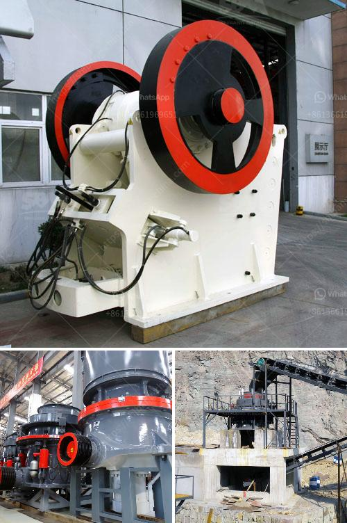

<h3>stone crusher prices</h3>
Stone crusher is a kind of equipment that crushes materials in the form of impact. Crushing the stone into small particles is an essential process in the fields of metallurgy, construction, mining, and quarrying. Stone crusher plants are equipped with a variety of crushing machines, such as jaw crushers, cone crushers, impact crushers, and sand making machines, which enables the crushing of materials to the required granularity. Stone crushers are indispensable machines in the mining and quarrying industry.

Different types of stone crushers have different models, names and functions. Sometimes they are named according to materials such as rock crushers, ore crushers, quarry crushers, granite crushers, concrete crushers, etc. Among those, jaw crusher is the most common, which can be divided into fixed jaw crushers and mobile jaw crushers depending on the way of installation.

Fixed jaw crusher machine is mainly used in secondary crushing of a variety of ores and bulk materials with compression strength no more than 320Mpa. The crushing process can be divided into coarse and fine crushing. The series of fixed jaw crusher is very complete and its feeding size is in the scope of 125mm-750mm. Most of the materials can be crushed without user's needs for further processing. It can process materials with side length less than 100-500mm.

Cone crusher is suitable for crushing materials with different hardness. Featured in the high working efficiency, strong working capacity and long service life, cone crushers are increasingly welcomed by users due to their reliable performance and low operating cost. Common cone crushers include spring cone crusher and hydraulic cone crusher. The price difference between the two types is relatively large, but the output material is cubic with good grain shape and low needle-like content.

Impact crusher is also known as the impact sand making machine. It is mainly used in the medium-hardness stone crushing operation with the advantages of high crushing efficiency, low energy consumption, uniform particle size, etc. This type of impact crusher can be divided into two types: single-rotor and double rotor, and the single rotor can be divided into reversible and irreversible types. The impact crusher is widely used in building materials, ore crushing, railway, highway, energy, transportation, cement, mining, chemical and other industries.

As we all know, the price of the stone crusher is directly related to the manufacturer, brand and specific model, in addition to the capacity and performance parameters of the machine. In general, the prices of stone crusher are different, but in different crushing equipment, the performance of the crushing machine is more prominent. Therefore, in production, the manufacturers should provide users with comprehensive services, such as pre-sale, sale, and after-sales services. Only in this way can we ensure the quality of the equipment and provide users with better services, so as to enhance the competitiveness of the manufacturers and expand the market share of the enterprise.

In conclusion, stone crushers are designed to provide the highest productivity at the lowest operating cost. They are suitable for various materials and meet the requirements of different users. Through continuous innovation, the price of stone crushers is becoming more and more affordable and customers are willing to invest in them. With the advancement of industrial technology, stone crushers will inevitably become more intelligent and automated in the future, providing users with more efficient, environmentally friendly and convenient crushing equipment.
<h3>Contact us</h3><ul><li><strong>Whatsapp:&nbsp;<a href="https://wa.me/8613661969651">+8613661969651</a></strong></li><li><a href="https://swt.shibang-china.com/?git&amp;zhl&amp;stone crusher prices"><strong>Online Service(chat now)</strong></a></li></ul><h3>Related</h3><ul><li><a href='crusher plant equipment.md'>crusher plant equipment</a></li><li><a href='price 200 crusher price.md'>price 200 crusher price</a></li><li><a href='distributor stone crusher di indonesia.md'>distributor stone crusher di indonesia</a></li><li><a href='drums for conveyor belts.md'>drums for conveyor belts</a></li><li><a href='10 tph cone crusher price.md'>10 tph cone crusher price</a></li></ul>