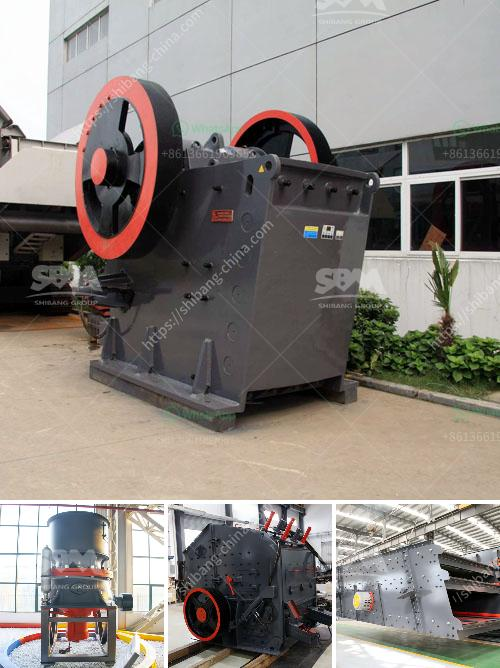

<h3>stone crusher sales company in kenya</h3>
Stone crusher sales company in Kenya is a large-scale mining machinery and equipment manufacturer that specializes in supplying stone crusher machines for mines, quarries, and other industries. The company has a wide range of reputable customers worldwide and provides products with excellent performance, high reliability, and low maintenance costs.

Stone crusher sales company in Kenya has maintained a good market reputation and has been cooperating with customers in Kenya for over 40 years. With advanced technology, excellent quality, and sincere service, it has won worldwide praise from customers. The equipment produced by the company uses high-quality raw materials and advanced production technology, providing a reliable guarantee for the operation of customers' projects.

One of the key advantages of stone crusher sales company in Kenya is its technical support team. They have rich experience in researching, designing, and manufacturing various types of stone crushers. They can provide professional advice and guidance for customers, helping them choose suitable equipment according to their production needs and specific site conditions. The technical support team also provides on-site installation guidance, commissioning, and training services to ensure customers can use the equipment correctly and efficiently.

In addition to providing high-quality equipment, stone crusher sales company in Kenya also provides comprehensive after-sales service. The company has a professional after-sales service team that can respond to customer inquiries and provide solutions in a timely manner. They can provide maintenance guidance, spare parts supply, and on-site maintenance services, ensuring that customers can use the equipment continuously without any worries.

The stone crusher sales company in Kenya is located in Nairobi, Industrial Area. Its main products are jaw crushers, cone crushers, sand making machines, vibrating screens, vibrating feeders, portable crushing plants, etc. These can be used for pebble, limestone, basalt, iron ore and other materials in production and processing, and have a wide range of applications. The equipment produced by the company has stable performance, high efficiency, and low failure rate, which can create higher benefits for customers and meet their various production needs.

Stone crusher sales company in Kenya has been producing high-quality products for many years. In the process of professional production, strict quality control measures are carried out to ensure the excellent quality of the products. The company also adheres to the principle of "customer first" and attaches great importance to the opinions and requirements of customers. It actively conducts market research and continuously improves its products and services based on feedback from customers, which has won the trust and recognition of customers.

In conclusion, stone crusher sales company in Kenya is a renowned and reliable brand in the mining and construction industry. The company continues to provide superior products and services to its customers, creating value and driving innovation. With continuous efforts and improvements, stone crusher sales company in Kenya strives to become a leading crushing equipment supplier in Kenya.
<h3>Contact us</h3><ul><li><strong>Whatsapp:&nbsp;<a href="https://wa.me/8613661969651">+8613661969651</a></strong></li><li><a href="https://swt.shibang-china.com/?git&amp;zhl&amp;stone crusher sales company in kenya"><strong>Online Service(chat now)</strong></a></li></ul><h3>Related</h3><ul><li><a href='stone crushing machines for sale.md'>stone crushing machines for sale</a></li><li><a href='how to set up a granite quarry.md'>how to set up a granite quarry</a></li><li><a href='jaw crusher indonesia agent.md'>jaw crusher indonesia agent</a></li><li><a href='diameter of the ball mill.md'>diameter of the ball mill</a></li><li><a href='difference between milling and grinding.md'>difference between milling and grinding</a></li></ul>