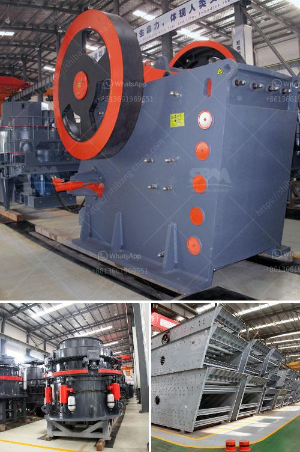

<h3>stone crusher seller</h3>
Crusher machines are commonly used for processing raw materials. A crusher is a machine designed to reduce large rocks into smaller ones. It is also used to change the form, waste materials into smaller size. A crusher is a machine designed to reduce large rocks into smaller rocks, gravel, sand, or rock dust. Crushers may be used to reduce the size, or change the form, of waste materials so they can be more easily disposed of or recycled, or to reduce the size of a solid mix of raw materials (as in rock ore), so that pieces of different composition can be differentiated. Crushing is the process of transferring a force amplified by mechanical advantage through a material made of molecules that bond together more strongly, and resist deformation more, than those in the material being crushed do.

Crushing devices hold material between two parallel or tangent solid surfaces, and apply sufficient force to bring the surfaces together to generate enough energy within the material being crushed so that its molecules separate from (fracturing), or change alignment in relation to (deformation), each other. The earliest crushers were hand-held stones, where the weight of the stone provided a boost to muscle power, used against a stone anvil. Querns and mortars are types of these crushing devices.

In the present scenario, stone crushing business is booming in India due to infrastructure development, which leads to a greater demand for crushed stones and products. In response to this, the government has allocated a significant portion of the state budget to the construction sector. As a result, the stone crushing industry is poised to continue its growth trajectory in the foreseeable future.

To ensure that their customers get the best quality product, stone crusher sellers and suppliers constantly strive to provide excellent customer service. They ensure that the machines they sell are of top-notch quality and are built to last. They also provide prompt after-sales service to their customers.

Stone crusher sellers have the flexibility to cater to different types of customers. They cater to infrastructure companies, construction companies, builders, individual homeowners, and various other types of customers. They understand that each customer has unique requirements and preferences, and they provide customized solutions accordingly.

In addition, stone crusher sellers offer a wide range of machines that can cater to different types of crushing needs. They offer primary jaw crushers, secondary cone crushers, tertiary cone crushers, and vertical shaft impact crushers. These machines are known for their high performance, durability, and reliability.

Furthermore, stone crusher sellers also take environmental concerns into consideration. They ensure that their machines comply with the necessary environmental standards and regulations. Some sellers even offer environmentally friendly crushers that consume less power and produce less dust and noise.

In conclusion, stone crusher sellers play a crucial role in the development of infrastructure and construction industry. They offer high-quality machines that can crush a variety of materials efficiently. They cater to various types of customers and provide customized solutions. Moreover, they prioritize environmental sustainability by offering eco-friendly crusher machines. With their dedication to customer satisfaction and commitment to excellence, stone crusher sellers are on a journey towards success.
<h3>Contact us</h3><ul><li><strong>Whatsapp:&nbsp;<a href="https://wa.me/8613661969651">+8613661969651</a></strong></li><li><a href="https://swt.shibang-china.com/?git&amp;zhl&amp;stone crusher seller"><strong>Online Service(chat now)</strong></a></li></ul><h3>Related</h3><ul><li><a href='concrete crusher kenya.md'>concrete crusher kenya</a></li><li><a href='cone crusher in america.md'>cone crusher in america</a></li><li><a href='buy gold crusher machine.md'>buy gold crusher machine</a></li><li><a href='nickel slag grinding project in turkey.md'>nickel slag grinding project in turkey</a></li><li><a href='price of stone crusher size.md'>price of stone crusher size</a></li></ul>