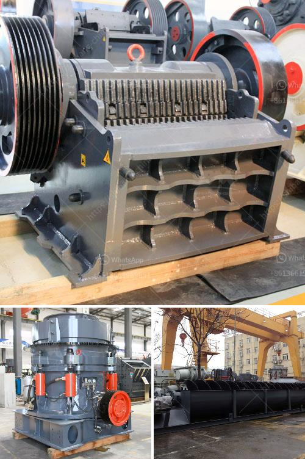

<h3>stone crusher south africa</h3>
Stone Crusher South Africa is a country located at the southern tip of Africa. It is bordered by Namibia, Botswana, Zimbabwe, Mozambique, Swaziland and Lesotho. It is a vast country with beautiful landscapes and diverse wildlife. South Africa is known for its rich cultural heritage and history.

Stone mining is a thriving business in the country. The country is one of the leading producers of precious stones such as diamonds and gold. It is also home to some of the largest mines in the world, including the famous Cullinan diamond mine, which is located in Gauteng Province.

Stone crushing in South Africa is primarily used for producing crushed stone and recycled concrete aggregates. Crushed stones are obtained from different types of stone such as limestone, granite, dolomite, traprock, sandstone, quartzite, marble and slate, and so on. 300-500 tph stone crushing machine supplier cost for stone crusher plant crusher,Indonesia stone crusher,Indonesia jaw crusher price,Indonesia cone .

Jaw Crusher. PE series jaw crusher is usually used as primary crusher in quarry production lines, mineral ore crushing plants and powder making plants. (Want to learn more) Impact Crusher. Impact crusher are mostly used as secondary crusher and it well fits for crushing numerous medium and soft mineral &rock materials. (Want to learn more).

Stone Crusher South Africa stone crusher is popularly utilized for mining in South Africa. We know that stone crusher employed to crush raw stones into small size and alter the form for instance limestone, granite, Iron ore, basalt quartz, marble, and so on. Shanghai SBM, which is the stone crusher producer, focused to the crushing machine technologies, supplying the customers versions of stone crushing plant.

The mining marketplace in South Africa is a major economic action which contributes considerably to the economic system of South Africa. As outlined by the ministry of mines estimates: South Africa has stepped up its production to achieve the 2nd rank amid the chromite producers in the globe. Apart from, South Africa ranks 3rd in production of coal & lignite, 2nd in barites, 4th in iron ore, 5th in bauxite and crude steel, 7th in manganese ore and 8th in aluminium.

Mining equipment in the South African market has great prospects for development. Stone Crusher For Sale Shanghai SBM provide many kinds of stone crusher machine for mining in south africa such as: jaw crusher, cone crusher, impact crusher, hammer crusher, roller crusher, VSI crusher, etc.

Jaw crusher is the successful experience of sets of similar products at home and abroad, concentrated on the study of the high-efficiency energy-saving crusher equipment. Among them medium-sized large jaw crusher is one of our leading products, especially in the design and production of large jaw crusher, at home and abroad has been the leading.

The working principle of jaw crusher price is very simple. The whole crushing process rely on the relative motion of the two jaw plates. One of the jaw plates stay still while the other move against it. And with the movement, the materials between the two plates would be crushed into small elements. While the plates move against each other, the materials would be crushed and while plates move away from each other, the broken materials which are smaller enough would drop through the discharging opening. And due to the simple structure, jaw crusher price is easy to maintain and repair. These features promote its popularity to a great extant.
<h3>Contact us</h3><ul><li><strong>Whatsapp:&nbsp;<a href="https://wa.me/8613661969651">+8613661969651</a></strong></li><li><a href="https://swt.shibang-china.com/?git&amp;zhl&amp;stone crusher south africa"><strong>Online Service(chat now)</strong></a></li></ul><h3>Related</h3><ul><li><a href='jaw crusher and cone crusher manufacturers in dubai.md'>jaw crusher and cone crusher manufacturers in dubai</a></li><li><a href='vertical mills retention time formula.md'>vertical mills retention time formula</a></li><li><a href='stone crushers machine malaysia.md'>stone crushers machine malaysia</a></li><li><a href='silica sand processing equipment.md'>silica sand processing equipment</a></li><li><a href='dust pollution control machine for stone crusher.md'>dust pollution control machine for stone crusher</a></li></ul>