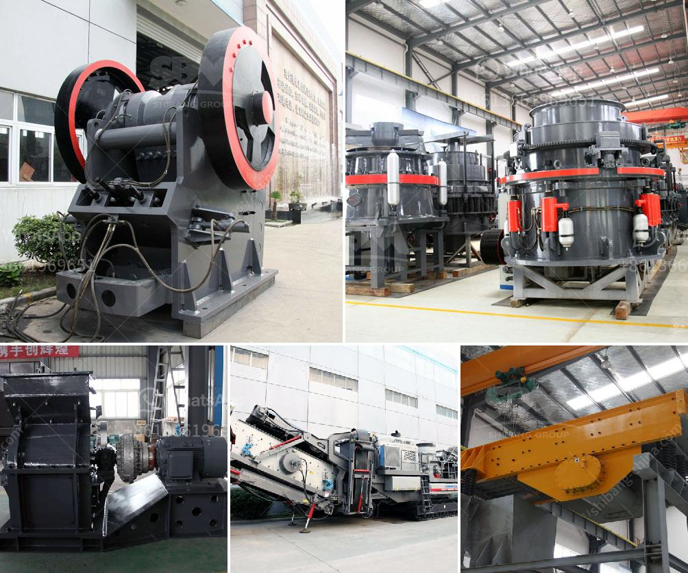

<h3>stone crusher specification</h3>
Stone crushing equipment is used for crushing stones into smaller size or change the form such as limestone, quartz, marble, granite and recycle building waste materials such as debris, asphaltic cement concrete. Usually in stone crushing plant, we crush stones into small particles with diameter of 10mm, 12mm, 19mm, 25mm, 50mm, 100mm.

Stone crushing equipment specifications vary from crusher to crusher. The production capacity range from 10 tons per hour to 1000 tons per hour. The input size of raw materials is less than 350mm. They are widely used in mining, metallurgical industry, building material, highway, railway, water conservancy and chemical industries.

The stone crushing equipment can produce different sizes of crushed stone. With the current growth rate of global urbanization, the stone crushing equipment market is anticipated to witness a surge in demand for crushers applied in the construction of infrastructure and other activities.

Stone crusher is one such industry that exists in the vicinity of almost all major cities, towns, and villages. Due to construction activities, the amount of stone waste is increasing resulting in landfill disposal which leads to land pollution. Stone crusher equipment has revolutionized the way stones are obtained through crushing. With this process, stones are broken into smaller pieces, making it easier to transport and use.

The stone crushing process consists of quarrying where the large blocks of mined material are brought to the crushing plant by large trucks or dumper and then poured into the primary crusher. After the initial crushing, the stone is conveyed to a secondary crusher where it is further broken down. The material is then screened to separate the crushed stone into different sizes. The final product is conveyed to stockpiles for storage or sold as desired.

Stone crushers are designed for a wide range of applications, from crushing mid-hard and above mid-hard ores and rocks, such as iron ore, copper ore, limestone, quartz, granite, roadbed stone, and many others. They are widely used in mining, smelting, building materials, highways, railways, water conservancy and chemical industries.

In order to choose the suitable stone crusher for your production line, you should have a clear understanding of the stone crusher specification. The common specifications for stones are in range of 0-5mm, 5-10mm, 10-20mm, 20-30mm, 30-40mm, 40-60mm and even larger. According to the clients’ requirement, the finished product size and shape can be adjusted by changing the screen size, crusher model, or adjusting the working parameters of the stone crusher.

In conclusion, stone crushing equipment is an integral part of the construction industry. It is used for reducing the size of stones so that they can be used for different purposes more efficiently. The stone crushing equipment specifications vary depending on the type of crusher being used and the equipment that is being used to feed the stone into the crusher. Regardless of the type of machine used, it is essential to carefully select the right stone crusher specification to ensure the desired final product size and shape are achieved.
<h3>Contact us</h3><ul><li><strong>Whatsapp:&nbsp;<a href="https://wa.me/8613661969651">+8613661969651</a></strong></li><li><a href="https://swt.shibang-china.com/?git&amp;zhl&amp;stone crusher specification"><strong>Online Service(chat now)</strong></a></li></ul><h3>Related</h3><ul><li><a href='stone crusher plant minimum capacity price in india.md'>stone crusher plant minimum capacity price in india</a></li><li><a href='coal crusher specification pdf.md'>coal crusher specification pdf</a></li><li><a href='jaw crusher 24x12 price.md'>jaw crusher 24x12 price</a></li><li><a href='granite rock sand machinery.md'>granite rock sand machinery</a></li><li><a href='nigeria rock crusher for sale.md'>nigeria rock crusher for sale</a></li></ul>