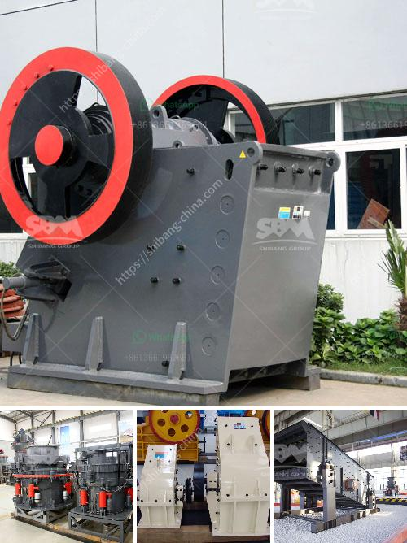

<h3>stone crusher supplier</h3>
Choosing the right stone crusher is essential, as the success of your project depends on finding the right one. To avoid costly mistakes, it is crucial to examine all potential suppliers before settling for one. Luckily, there are some excellent suppliers in the market that offer high-quality stone crushers, ensuring smooth operation and maximum returns on your investment.

One such reliable supplier is <<Supplier's Name>>. With years of experience in the industry, this supplier has earned a reputation for delivering top-notch crushing equipment that meets the diverse needs of customers. Here's why choosing <<Supplier's Name>> as your stone crusher supplier is a wise decision:

<<Supplier's Name>> offers a wide range of stone crushers, catering to various applications. Whether you need a primary crusher for crushing hard materials or a secondary crusher for enhancing particle shape, they have the perfect solution for you. Their product range includes jaw crushers, impact crushers, cone crushers, and even mobile crushers, ensuring that you find the right equipment for your specific requirements.

When it comes to stone crushers, quality is of utmost importance. <<Supplier's Name>> understands this and ensures that all their crushers are constructed using robust materials and advanced technology. This ensures that their equipment can withstand extreme conditions, provide efficient operation, and deliver consistent performance for years to come.

Every project has unique considerations, and sometimes, standard crushers may not be suitable. That's where <<Supplier's Name>> comes in. They offer customization options, allowing you to tailor the equipment to your precise needs. From adjusting the crusher's feed opening to modifying the rotor design, they can make the necessary enhancements to meet your application requirements.

Choosing a stone crusher supplier is not just about the delivery of the machinery; it's also about the after-sales support you receive. <<Supplier's Name>> understands the importance of providing excellent customer service. They have a team of trained professionals who are available to assist you with any technical issues or concerns you may have. Whether you need spare parts, maintenance advice, or troubleshooting assistance, they are just a call away.

Investing in a stone crusher can be a significant financial decision. <<Supplier's Name>> recognizes this and offers competitive pricing on their equipment. They believe that getting high-quality machinery shouldn't cost you a fortune, enabling you to make a wise investment without breaking the bank.

In conclusion, when you're in the market for a stone crusher supplier, it's crucial to choose a reliable and reputable company. With their wide range of products, high-quality machinery, customization options, excellent after-sales support, and competitive pricing, <<Supplier's Name>> ticks all the right boxes. By partnering with them, you can resolve your crushing problems, achieve efficient operations, and ensure long-term success for your project.
<h3>Contact us</h3><ul><li><strong>Whatsapp:&nbsp;<a href="https://wa.me/8613661969651">+8613661969651</a></strong></li><li><a href="https://swt.shibang-china.com/?git&amp;zhl&amp;stone crusher supplier"><strong>Online Service(chat now)</strong></a></li></ul><h3>Related</h3><ul><li><a href='gold refinery equipment china.md'>gold refinery equipment china</a></li><li><a href='quarry stone crushing machine manufacturers.md'>quarry stone crushing machine manufacturers</a></li><li><a href='wet ultra fine fine grinding equipment.md'>wet ultra fine fine grinding equipment</a></li><li><a href='2nd hand crushers thailand.md'>2nd hand crushers thailand</a></li><li><a href='quartz stone crusher.md'>quartz stone crusher</a></li></ul>