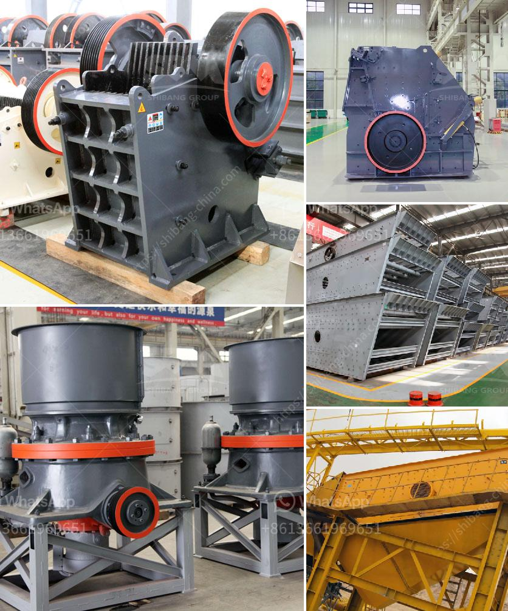

<h3>stone crusher to diessel</h3>
In the past, the construction industry relied on traditional stone crushers powered by diesel, and they were an essential part of any project. However, as technology advanced, stone crushers became more efficient, reducing the size, weight, and cost of these machines. Today, stone crushers are powered by electricity and hydraulic power, making them more modern and efficient. Yet, there are still instances where stone crushers powered by diesel remain essential.

Before delving into the reasons why stone crushers powered by diesel are still relevant, it is important to understand what a stone crusher is and what it does. A stone crusher is a machine that breaks down large rocks into smaller pieces or dust. It is usually used for construction purposes, as it reduces large-sized stones into manageable pieces that can be further used for various construction projects. These machines come in many sizes and configurations to suit different project requirements.

Nowadays, the construction industry is increasingly focused on sustainable practices and reducing carbon emissions. Electric and hydraulic-powered stone crushers have become more popular over the years. However, there are still situations where the use of diesel-powered stone crushers is necessary.

Firstly, stone crushers powered by diesel are highly mobile. This is especially important in the construction industry, where projects often require moving between different locations. Diesel-powered stone crushers can easily be transported to different sites without the need for complex infrastructure. This mobility allows construction companies to save time and money.

Secondly, stone crushers powered by diesel have a higher productivity rate compared to their electric or hydraulic counterparts. When operating at full capacity, diesel-powered stone crushers can crush large quantities of materials efficiently. This is particularly important in projects where a high volume of crushed stone is required, such as road construction or building foundations. The higher productivity rate offered by diesel-powered stone crushers enables construction companies to complete projects on time and within budget.

Furthermore, stone crushers powered by diesel are often the preferred choice in remote areas where there is limited or no access to electricity. In these regions, diesel-powered stone crushers provide a reliable source of power and ensure uninterrupted operations. This is particularly critical in countries where infrastructure development is still in progress.

Despite the advantages of stone crushers powered by diesel, it is important to acknowledge that they come with some downsides. Diesel-powered stone crushers require regular maintenance, such as oil changes and filter replacements. Additionally, diesel fuel can be expensive, and fluctuations in fuel prices can impact the overall cost of operations.

In conclusion, the use of stone crushers powered by diesel remains a relevant and necessary choice in today’s construction industry. While electric and hydraulic-powered stone crushers have become more popular in recent years, they cannot match the efficiency and mobility offered by diesel-powered machines. Stone crushers powered by diesel are highly mobile, have a higher productivity rate, and are reliable in remote areas. However, it is important for construction companies to carefully consider the overall costs and maintenance requirements before opting for diesel-powered stone crushers. By striking the right balance, construction companies can maximize productivity and achieve their project goals efficiently and sustainably.
<h3>Contact us</h3><ul><li><strong>Whatsapp:&nbsp;<a href="https://wa.me/8613661969651">+8613661969651</a></strong></li><li><a href="https://swt.shibang-china.com/?git&amp;zhl&amp;stone crusher to diessel"><strong>Online Service(chat now)</strong></a></li></ul><h3>Related</h3><ul><li><a href='silica sand washing purification.md'>silica sand washing purification</a></li><li><a href='europe stone quarry equipment supplier.md'>europe stone quarry equipment supplier</a></li><li><a href='used stone crushers for sale south africa.md'>used stone crushers for sale south africa</a></li><li><a href='gravel crusher supplier in the philippines.md'>gravel crusher supplier in the philippines</a></li><li><a href='price of conveyor belts.md'>price of conveyor belts</a></li></ul>