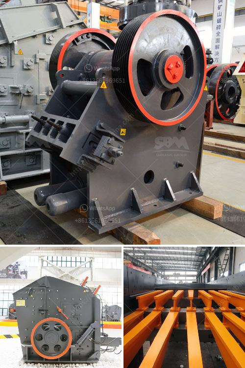

<h3>stone crusher turkey</h3>
Stone Crusher Turkey, as a specialist manufacturer of mining equipment, is newly constructed by the leading manufacturers of mining equipment such as SBM. The cone crusher is a high-performance model optimized and improved on the basis of traditional ones. The cone stone crusher has exceptional reliability, excellent productivity, and low energy consumption. If you are in need of a stone crusher, Turkey represents a great choice with its exceptional quality and high-performance machinery.

With a broad range of applications, the stone crusher Turkey market has been broadly demanding for its great value. A variety of stone crushers are manufactured to meet the demands of different customers, including jaw crushers, cone crushers, impact crushers, and even multi-functional crushers. In recent years, Turkey's infrastructure construction has been developing rapidly. Therefore, stone crusher machines can be found in various regional areas, mainly including major cities such as Istanbul, Ankara, Izmir, and Bursa, where construction activities are constantly increasing.

The stone crushing process is widely used in metallurgy, building materials, mining, chemical, cement, coal gangue, construction waste, and other industries. With the rapid development of technology, the cone crusher has been widely used in various industries. The cone crusher is used for medium and fine crushing stage in stone crushing plant. It is widely used in mining, smelting, building materials, highway, railway, water conservancy, chemical industry, and other industries.

Turkey has abundant stone sources, including limestone, marble, granite, travertine, volcanic rock, andesite, slate, basalt, etc. These different types of stone can be used for various purposes, such as construction, decoration, landscaping, and aggregate production. The stone resources are widely distributed in different regions of Turkey, which provides an excellent condition for stone crusher Turkey.

In addition to the excellent performance of the stone crusher, the after-sales service of the manufacturer is also very important. SBM, a leading manufacturer of mining machinery in Turkey, provides reliable and efficient after-sales service for stone crusher Turkey. As for the price of the stone crusher, different manufacturers have different prices. The price of stone crusher Turkey may vary according to the size and capacity of the machine.

Turkey's mining industry is on the rise, and stone crusher machines are at the leading edge of the market. There are many manufacturers in Turkey, which provide various stone crusher machines for sale. In Turkey, construction projects require large quantities of aggregate materials. Therefore, stone crusher Turkey is in great demand. The cone crusher is an important piece of machinery for various businesses.

To sum up, Turkey's stone crusher market is strong, and diversified trading opportunities exist in different regions of Turkey. The stone crusher Turkey market is going to reach $5 billion by 2025. Further, Turkey is one of the largest stone crusher markets in the Middle East. Therefore, stone crusher machinery manufacturer in Turkey is leading the construction sector in providing the required raw material.
<h3>Contact us</h3><ul><li><strong>Whatsapp:&nbsp;<a href="https://wa.me/8613661969651">+8613661969651</a></strong></li><li><a href="https://swt.shibang-china.com/?git&amp;zhl&amp;stone crusher turkey"><strong>Online Service(chat now)</strong></a></li></ul><h3>Related</h3><ul><li><a href='stone crusher mills in mercadolibre.md'>stone crusher mills in mercadolibre</a></li><li><a href='brushes for conveyor belts.md'>brushes for conveyor belts</a></li><li><a href='ball milling machines suppliers in egypt.md'>ball milling machines suppliers in egypt</a></li><li><a href='marble quarry business plan.md'>marble quarry business plan</a></li><li><a href='vertical vertical roller mill.md'>vertical vertical roller mill</a></li></ul>