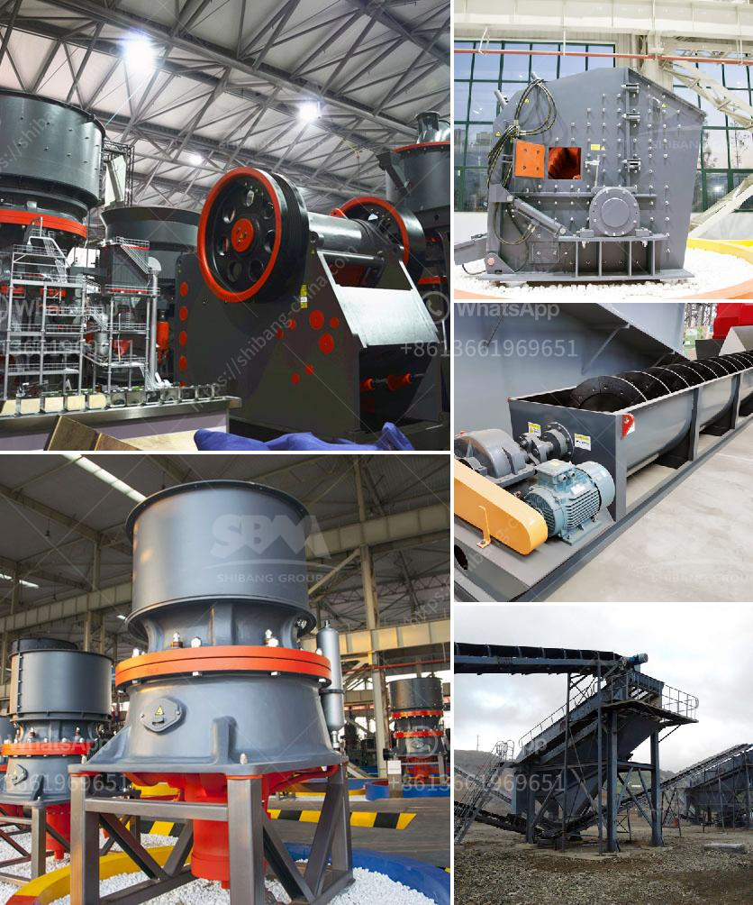

<h3>stone crushers baby</h3>
In the world of construction and landscaping, countless machines and equipment play a pivotal role in performing various tasks. Among these machines, stone crushers baby has emerged as an essential tool for breaking down larger rocks into smaller, more manageable sizes. With their powerful capabilities, these machines have revolutionized the construction industry by simplifying the process of crushing stones and making building projects more efficient.

Stone crushers baby are specially designed machines that are used to reduce the size, or change the form, of stones into smaller pieces. A stone crusher baby consists of various components, including a hopper, a vibrating feeder, jaw crushers, impact crushers, vibrating screens, and belt conveyors. These machines work together to break down larger rocks into smaller, more manageable sizes, suitable for construction purposes.

The primary goal of stone crushers baby is to crush the stones or rocks into specific sizes. This process involves the use of powerful jaws or hammers that exert force on the stones, breaking them apart. The crushed stones can then be used for a variety of purposes, including road base, concrete aggregate, and landscaping materials. By reducing the size of stones, stone crushers baby make it easier to transport and utilize the material, saving time, effort, and money on construction projects.

One of the key advantages of using stone crushers baby is the efficiency they bring to construction projects. With their powerful capabilities, these machines can crush large rocks in a matter of minutes, speeding up the construction process significantly. This eliminates the need for manual labor and reduces the risk of injuries associated with breaking down stones manually. Additionally, stone crushers baby provide consistent and uniform results, ensuring that the crushed stones meet the required specifications for each project.

Another benefit of stone crushers baby is their versatility. These machines can be used to process a wide variety of materials, including limestone, granite, basalt, sandstone, and more. This flexibility allows contractors and builders to utilize stone crushers baby for multiple applications, from road construction to landscaping projects. With the ability to crush different types of stones, these machines offer a cost-effective solution for various construction needs.

Moreover, stone crushers baby are designed to be durable and reliable, capable of handling heavy-duty workloads. Manufacturers use high-quality materials and advanced technology to ensure these machines can withstand the harsh conditions of construction sites. This durability ensures that stone crushers baby can continue to operate efficiently for an extended period, providing exceptional value for construction businesses.

In conclusion, stone crushers baby have become indispensable machines in the construction industry. Their ability to break down large rocks into smaller, more manageable sizes has revolutionized the way construction projects are executed. With their powerful capabilities, efficiency, versatility, and durability, stone crushers baby offer a cost-effective solution for various construction needs. These machines have undoubtedly changed the game, making construction projects more efficient, safer, and less labor-intensive. As the world continues to evolve and develop, stone crushers baby will remain an essential tool for construction and landscaping projects.
<h3>Contact us</h3><ul><li><strong>Whatsapp:&nbsp;<a href="https://wa.me/8613661969651">+8613661969651</a></strong></li><li><a href="https://swt.shibang-china.com/?git&amp;zhl&amp;stone crushers baby"><strong>Online Service(chat now)</strong></a></li></ul><h3>Related</h3><ul><li><a href='mobile crusher ghana.md'>mobile crusher ghana</a></li><li><a href='contribution of quarrying in nigeria economy.md'>contribution of quarrying in nigeria economy</a></li><li><a href='mining screens and crushing equipment.md'>mining screens and crushing equipment</a></li><li><a href='sand washing screening machine.md'>sand washing screening machine</a></li><li><a href='concrete crusher kenya.md'>concrete crusher kenya</a></li></ul>