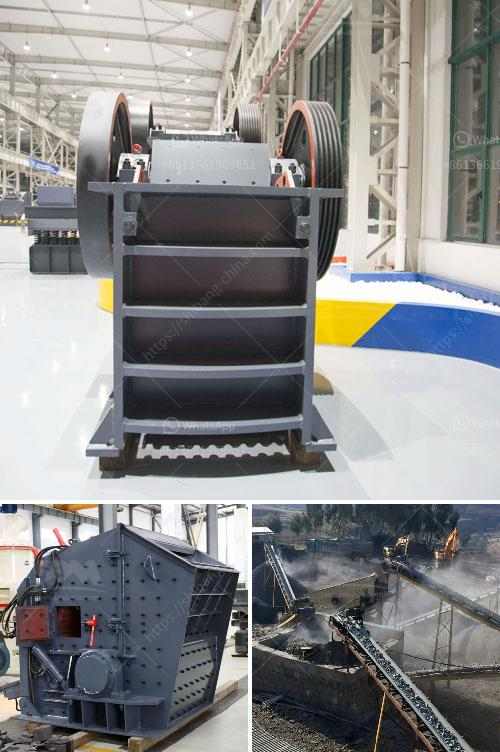

<h3>stone crushers for sale uk finance</h3>
Stone crushers are robust machines that are used to crush rocks and reduce them into smaller sizes for eventual use in construction projects. These powerful machines come in a variety of sizes and configurations, offering an array of options for your construction needs.

With the growing demand for infrastructure development, the stone crusher market is booming in the UK. There are many companies that are selling stone crushers in the UK, including financial institutions, allowing customers to finance a stone crusher purchase.

When deciding on purchasing a stone crusher, it’s important to consider several factors to ensure you choose the right equipment for your construction needs. One of the crucial factors is the size of the stones you need to crush. Different crushers are designed to handle different sizes of stones, so it’s important to choose a stone crusher that can efficiently process the size of stones you need.

Another factor to consider is the production capacity of the stone crusher. This refers to the amount of material that the crusher can process at a given time. If you have a large construction project that requires a high volume of crushed stones, you should opt for a stone crusher with a high production capacity. On the other hand, if you have a smaller project and don’t need a large quantity of crushed stones, a stone crusher with a lower production capacity may suffice.

In addition to size and production capacity, it’s also important to consider the type of stone crusher that best suits your needs. There are several types of stone crushers available in the market, such as jaw crushers, cone crushers, impact crushers, and even hybrid crushers that combine the features of both jaw and cone crushers. Each type of crusher has its own advantages and disadvantages, so it’s crucial to choose the right one for your project.

Nowadays, financing options are available for purchasing stone crushers in the UK. Many financial institutions offer loans and leasing options to customers looking to buy a stone crusher. These finance options allow customers to easily acquire the equipment they need without having to bear the full cost upfront. This is particularly beneficial for small businesses and contractors who may not have the immediate funds to purchase a stone crusher.

When considering financing options, it’s important to carefully review the terms and conditions of the loan or lease agreement. This includes the interest rate, repayment schedule, and any additional fees or charges associated with the finance package. It’s also recommended to compare different financial institutions to find the best deal that suits your specific requirements.

In conclusion, stone crushers play a crucial role in the construction industry in the UK. They are powerful machines that are used to crush rocks into smaller sizes for use in various construction projects. When looking to purchase a stone crusher, it’s important to consider factors such as size, production capacity, and type of crusher. Additionally, financing options are available for customers who wish to purchase a stone crusher without affording the full cost upfront. By carefully considering your needs and exploring financing options, you can easily acquire a stone crusher that meets your requirements and contributes to the success of your construction projects.
<h3>Contact us</h3><ul><li><strong>Whatsapp:&nbsp;<a href="https://wa.me/8613661969651">+8613661969651</a></strong></li><li><a href="https://swt.shibang-china.com/?git&amp;zhl&amp;stone crushers for sale uk finance"><strong>Online Service(chat now)</strong></a></li></ul><h3>Related</h3><ul><li><a href='small ball mill suppliers in sri lanka.md'>small ball mill suppliers in sri lanka</a></li><li><a href='magnesite processing plant.md'>magnesite processing plant</a></li><li><a href='cost of setting up a quarry crusher plant.md'>cost of setting up a quarry crusher plant</a></li><li><a href='iron ore vibrator screen.md'>iron ore vibrator screen</a></li><li><a href='coal wash plants for sale in malaysia.md'>coal wash plants for sale in malaysia</a></li></ul>