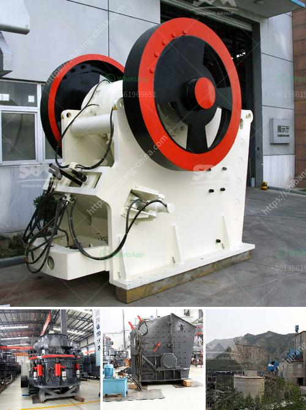

<h3>stone crushers hydraulic</h3>
Stone crusher machines are widely used in mining industry. There are various types of crusher machines in the market, such as jaw crusher, counterattack crusher, vertical impact crusher, hydraulic cone crusher, hammer crusher, roll crusher, compound crusher, cone crusher, the two-stage crusher, gyratory crusher, mobile crusher and so on. 

The hydraulic stone crusher was re-designed due to the rise of technical advancement. In 1970, this model of crusher was equipped with an automatic controller for better management. What are the Different Types of Crushers? There are 2 main kinds of crushers: primary crushes and secondary crushers. These two main types are categorized by the size of materials they can be used to reduce. In this article, we will be discussing the different types of crushers hydraulic and their uses. 

The hydraulic stone crusher is made up of one hydraulic cylinder, one hydraulic valve and one piston. It has three main functions: protection, adjustment and cavity cleaning. It also uses the hydraulic system to adjust the size of the discharge opening to control the particle size. The hydraulic system can effectively ensure the safe operation of the equipment. 

The hydraulic stone crusher adopts high alloy wear-resistant materials, which greatly lengthen the service life of the machine and improve the crushing efficiency. The hydraulic stone crusher adopts a unique cavity shape, which increases the crushing capacity and makes the product granules more uniform. The shape of the hydraulic stone crusher greatly improves the technical level of the equipment, and it also significantly enhances the overall competitiveness of the equipment. 

The application of hydraulic stone crusher is abundant in various industries, such as mining industry, metallurgy industry, cement industry, chemical industry and building materials industry. It is used to crush various kinds of ores and rocks with medium and high hardness, such as quartz stone, river pebble, limestone, calcite, granite, basalt, diabase, etc.

In conclusion, hydraulic stone crusher machines are ideal equipment for processing stones. They are valuable in the mining industry due to their high degree of reliability, superior productivity, and low maintenance costs. Furthermore, stone crushers hydraulic offer exceptional performance in terms of crushing capacity, particle uniformity, and energy efficiency. Therefore, they are widely used in various industries. The hydraulic stone crusher has evolved to become a highly efficient and intelligent machine that crushes stones effortlessly. 

As a professional manufacturer of stone crushers hydraulic, we constantly create high-quality products and provide comprehensive services for customers. We are committed to continuously improving our technology and providing customers with more reliable and efficient machines. Whether you need a single machine or a complete crushing production line, we can provide customized solutions to meet your specific requirements.
<h3>Contact us</h3><ul><li><strong>Whatsapp:&nbsp;<a href="https://wa.me/8613661969651">+8613661969651</a></strong></li><li><a href="https://swt.shibang-china.com/?git&amp;zhl&amp;stone crushers hydraulic"><strong>Online Service(chat now)</strong></a></li></ul><h3>Related</h3><ul><li><a href='stone crushing machinery suppliers.md'>stone crushing machinery suppliers</a></li><li><a href='conveyor belt suppliers in lusaka.md'>conveyor belt suppliers in lusaka</a></li><li><a href='capacity of the ball mill and rod mill.md'>capacity of the ball mill and rod mill</a></li><li><a href='quartz grinding plants in philippines.md'>quartz grinding plants in philippines</a></li><li><a href='10 tph cone crusher price.md'>10 tph cone crusher price</a></li></ul>