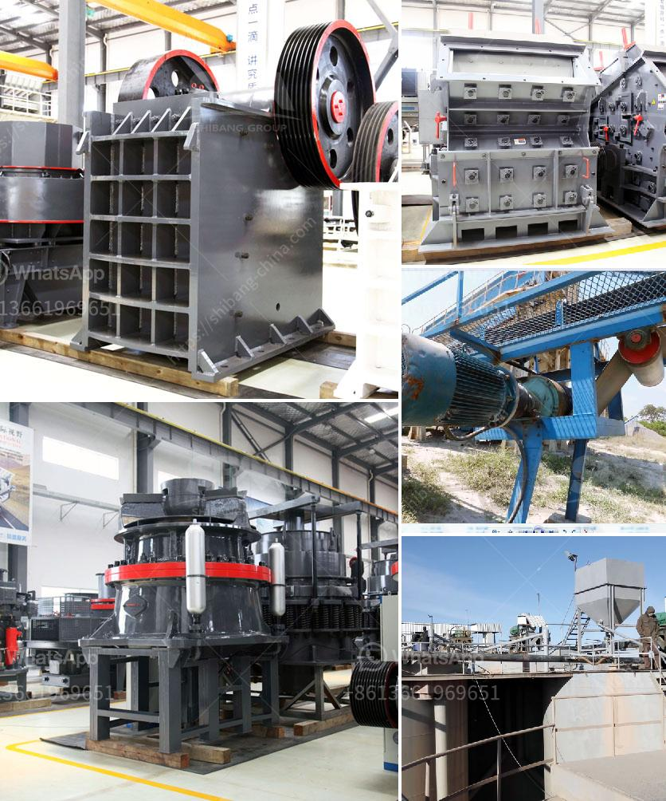

<h3>stone crushers in ethiopia</h3>
Stone crushing industry is an important industrial sector in Ethiopia, engaged in producing crushed stone used as raw material for various construction activities such as construction of roads, bridges, buildings, and canals. The project is assumed to have a substantial economic impact on the development of the country and its surrounding regions.

Stone crushing unit equipment is widely used in aggregate production, construction waste recycling, mining, engineering construction, earth and stone engineering and other fields. Crushers, screens, feeders, and conveyors are common in these workplaces while stationary and portable systems are also available.

Stone crushers are generally located near construction sites and residential areas to meet the increasing demand for building materials. It is estimated that there are over 12,000 stone crusher units in Ethiopia. The operations of these units generate a significant amount of environmental pollution due to quarrying activities and crusher operations.

Environmental pollution is a major issue in Ethiopia. Heavy machinery used in these mines not only pollute the air but also pose a health risk to workers and residents living in the vicinity of these sites. Dust pollution from quarrying can also have an adverse impact on agricultural land, affecting crop productivity.

Ethiopia has introduced various regulations to control dust pollution and emissions from stone crushers. The Ministry of Environment, Forest, and Climate Change (MoEFCC) has notified stringent guidelines for pollution control in the stone crushing industry. The guidelines focus on minimizing the generation of dust, preventing water and air pollution, and adopting eco-friendly practices.

Stone crusher units are also required to comply with the Noise Pollution (Regulation and Control) Rules, 2000. Noise pollution has effects on human health, such as hearing loss, stress, high blood pressure, and sleep disturbances. Measures such as soundproofing equipment and regular monitoring of noise levels are necessary to ensure compliance with these rules.

In addition to environmental concerns, stone crushers also face challenges related to occupational safety. Accidents and injuries at these sites are not uncommon, and fatalities have been reported in the past. To prevent such incidents, the Ministry of Labor and Employment has issued guidelines on safety and health in the stone crushing industry. These guidelines cover issues such as machinery guarding, worker training, and emergency response protocols.

Despite the challenges, the stone crushing industry in Ethiopia has significant potential for growth and job creation. The market is booming as infrastructure projects continue to be developed and demand for construction materials increases. Stone crushers play a vital role in the production of concrete, asphalt, and other materials used in construction.

To ensure sustainable development and minimize the negative impact on the environment, stone crushers in Ethiopia need to adhere to strict environmental regulations. The government should enforce these regulations effectively and provide support and incentives to encourage stone crusher operators to adopt eco-friendly practices.

Moreover, awareness programs and training sessions should be organized to educate workers and residents about the potential health risks associated with stone crushing operations. Regular monitoring of dust and noise levels should be conducted by relevant authorities to ensure compliance with pollution control measures.

By implementing these measures, the stone crushing industry in Ethiopia can play its part in the country's sustainable development while minimizing its environmental and social impacts.
<h3>Contact us</h3><ul><li><strong>Whatsapp:&nbsp;<a href="https://wa.me/8613661969651">+8613661969651</a></strong></li><li><a href="https://swt.shibang-china.com/?git&amp;zhl&amp;stone crushers in ethiopia"><strong>Online Service(chat now)</strong></a></li></ul><h3>Related</h3><ul><li><a href='conveyor belts for dies.md'>conveyor belts for dies</a></li><li><a href='china dahua series jaw crusher.md'>china dahua series jaw crusher</a></li><li><a href='screening coal crushing plant.md'>screening coal crushing plant</a></li><li><a href='coal conveyor supplier from india.md'>coal conveyor supplier from india</a></li><li><a href='crushers of cone ethiopia.md'>crushers of cone ethiopia</a></li></ul>