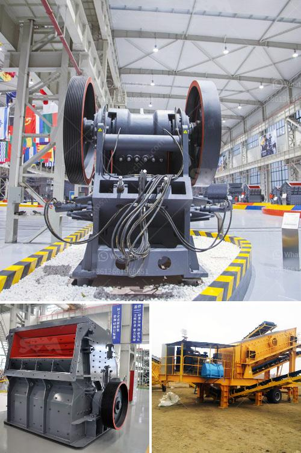

<h3>stone crushers machine malaysia</h3>
Stone crushers machine is widely used in highway, railway, building construction, infrastructure construction, while is usually the first choice for high cost performance and comparative professionals. For jaw stone crusher, it is usually used as primary crushing machine, for it features large production capacity, simple structure, reliable performance and easy operation. Varieties of stationary stone crusher in Malaysia are currently available, including certain specifications for crushed stone upon request, while retaining its relatively low mud content, which is less than 1%.

Mobile Jaw Crusher is designed to meet the needs of the construction waste processing. Using the special machinery, the construction waste is crushed and screened, then is widely used in cement brick, pavement and construction. This new technology has truly reused the construction waste, will benefit the state and people. And it provides a brand new development ideas for the urban development got onto the track of sound development.

In Malaysia, the main source of sand is from in-stream mining. This type of mining is a common practice because mining locations are usually near the “market” or along a transportation route, which can reduce transportation costs. However, in-stream sand mining can damage private and public properties as well as aquatic habitats.

Excavation and dredging of sand and gravel have been popular in Malaysia for many years, mainly because Malaysian rivers are naturally replenished with sand every year. However, the excessive extraction of riverbed materials has caused widespread environmental problems, including it affecting the stability of the river banks, leading to erosion and riverbank failures.

Stone crushers machine Malaysia is widely used in mineral ore mining, metallurgical, construction buiding, chemistry, petrochemicals, transporta- tion, energy industry, suitable for crushing high hard, mid hard and soft rocks and ores such as iron ore, limestone, slag, marble, quartz, granite, cement, clinker and so on. For many years, XSM experts have been dedicated in stone crushing technology research and development. Our stone crushers machine Malaysia is suitable for crushing a variety of medium hard and above mid hard ores and rocks.

For example, our jaw crushers are able to work continuously with reliable quality and crushing economy. Our jaw crusher machine is suitable for both stationary and mobile crushing process.
<h3>Contact us</h3><ul><li><strong>Whatsapp:&nbsp;<a href="https://wa.me/8613661969651">+8613661969651</a></strong></li><li><a href="https://swt.shibang-china.com/?git&amp;zhl&amp;stone crushers machine malaysia"><strong>Online Service(chat now)</strong></a></li></ul><h3>Related</h3><ul><li><a href='crushing equipment in south africa.md'>crushing equipment in south africa</a></li><li><a href='safety poster for coal handling plant.md'>safety poster for coal handling plant</a></li><li><a href='crusher size reduction ratio.md'>crusher size reduction ratio</a></li><li><a href='cone crusher south africa.md'>cone crusher south africa</a></li><li><a href='feldspar grinding plant.md'>feldspar grinding plant</a></li></ul>