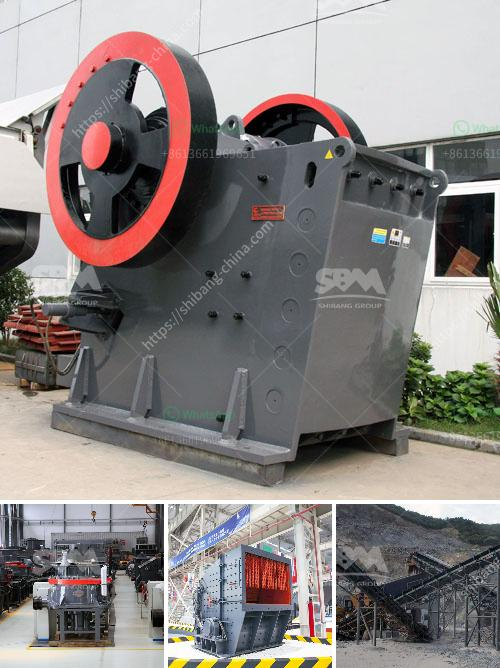

<h3>stone crushers made in china</h3>
Stone crushers are widely used machines for crushing and grinding materials into smaller pieces. They are often used in mining, construction, and other industries to reduce the size of raw materials and bring them to usable sizes. Made in China, stone crushers have been popular for decades and are commonly used in the mining industry.

China is one of the world's largest producers of stone crushers and has a wealth of experience in manufacturing these machines. China's stone crushing industry is booming, with the expansion of infrastructure construction across the country. The government has implemented policies to promote the development of this industry, and stone crushers made in China are playing an important role in this process.

Stone crushers made in China come in a variety of sizes and types, including both electric and diesel-powered engines. Different crushers have different capacities and crushing effects. Some stone crushers are designed to produce very fine materials, while others are capable of producing larger rocks and stones. The choice of crusher depends on the type and size of the raw material to be crushed and the desired output size.

One of the most popular types of stone crushers made in China is the cone crusher. Cone crushers are widely used in mining, metallurgy, building materials, road construction, and other fields. The cone crusher can crush medium and high hardness materials such as granite, basalt, and limestone. It has a large crushing ratio and high production efficiency, making it a popular choice for many customers.

Another commonly used type of stone crusher made in China is the jaw crusher. Jaw crushers are used for primary and secondary crushing of materials. The crushing chamber is composed of two jaw plates, a fixed jaw plate and a movable jaw plate. The material is crushed between the two jaw plates, and the crushed material is discharged from the bottom of the crushing chamber.

In recent years, stone crushers in China have been continuously improved with the advancement of technology. Many stone crushers are now equipped with advanced hydraulic systems, which greatly improve their performance and efficiency. Hydraulic systems provide overload protection, automatic adjustment of discharge port size, and easy maintenance. These advancements in technology have made stone crushers more reliable and efficient, resulting in increased productivity for users.

In addition to cone crushers and jaw crushers, China also produces impact crushers, hammer crushers, and other types of stone crushers. These crushers have their own unique features and advantages, catering to different needs of customers. Stone crushers made in China are known for their high quality, durability, and long service life.

In conclusion, stone crushers made in China are an important part of the mining industry and play a vital role in the construction of infrastructure. With the continuous development of China's economy and the advancement of technology, stone crushers made in China will continue to evolve and improve. They will remain highly sought after in various industries for their excellent performance and reliability.
<h3>Contact us</h3><ul><li><strong>Whatsapp:&nbsp;<a href="https://wa.me/8613661969651">+8613661969651</a></strong></li><li><a href="https://swt.shibang-china.com/?git&amp;zhl&amp;stone crushers made in china"><strong>Online Service(chat now)</strong></a></li></ul><h3>Related</h3><ul><li><a href='kaolin mining india.md'>kaolin mining india</a></li><li><a href='equipment equipment for mineral crushing.md'>equipment equipment for mineral crushing</a></li><li><a href='manufacturer of clinker grinding machine.md'>manufacturer of clinker grinding machine</a></li><li><a href='pe 600 900 primary jaw crusher.md'>pe 600 900 primary jaw crusher</a></li><li><a href='big stone quarry business plan pdf.md'>big stone quarry business plan pdf</a></li></ul>