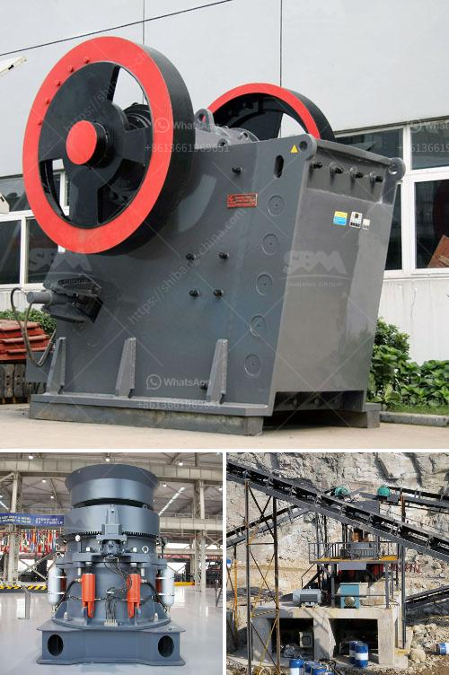

<h3>stone crushing equipment south africa</h3>
Stone Crushing Equipment South Africa, commonly known as sand making machine, is a kind of high-energy and low-consumption impact crusher with international advanced level. Its performance plays an irreplaceable role in various ore fine breaking equipment. It is used in construction sand, ore crushing, railway, highway, energy, transportation, energy, cement, mining, chemical and other industries for medium and fine crushing materials.

The stone crushing equipment market is witnessing the emergence of mobile crushing machines that can function in demanding environments. For instance, in April 2018, McCloskey announced the launch of its new impact crushers at Intermat. The new machines have mobility features to deliver versatility and high performance.

The increasing adoption of stone crushers in various sectors, such as mining, infrastructure and construction, highways and rail, would boost the market demand of stone crushers over the projected time frame. The rise in mining activities throughout the Asian markets has contributed in a rise in the use of this equipment in the area. Constantly increasing governmental regulations further contribute to the demand, as various governmental agencies promote the use of stone crushing equipment in various strategic locations.

South Africa, being one of the major developing economies, continuously striving to provide affordable housing to its population, is estimated to be the largest market in the African region. In addition, increasing government spending on infrastructure and mining activities are anticipated to boost the demand for stone crushing equipment in the region.

The Middle East and Africa are also anticipated to register a substantial industry growth with upcoming projects related to the construction of skyscrapers, airports, and commercial buildings. The increasing popularity of stone crushers in the mining industry due to its ability to crush granite, iron ore, and other minerals efficiently will spherical roller bearings generate higher load carrying capacity and increased equipment uptime.

In conclusion, the South African stone crushing equipment market is expected to witness a strong growth over the forecast period due to the rising demand for construction materials in the country. Additionally, increasing mining activities in the region will further contribute to the market growth. However, unstable economic conditions and stringent government regulations may pose a challenge to the market players.
<h3>Contact us</h3><ul><li><strong>Whatsapp:&nbsp;<a href="https://wa.me/8613661969651">+8613661969651</a></strong></li><li><a href="https://swt.shibang-china.com/?git&amp;zhl&amp;stone crushing equipment south africa"><strong>Online Service(chat now)</strong></a></li></ul><h3>Related</h3><ul><li><a href='stone crusher machine philippines.md'>stone crusher machine philippines</a></li><li><a href='stone crushers hydraulic.md'>stone crushers hydraulic</a></li><li><a href='hammer crusher price one ton per hour.md'>hammer crusher price one ton per hour</a></li><li><a href='grinding mill usa.md'>grinding mill usa</a></li><li><a href='dolomite production.md'>dolomite production</a></li></ul>