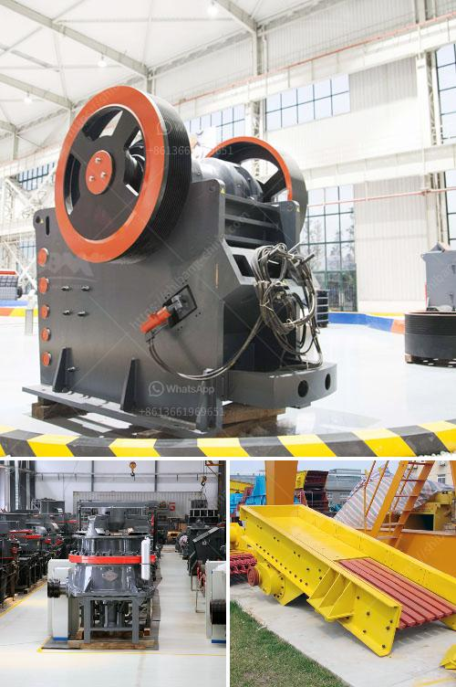

<h3>stone crushing importer companies in south africa</h3>
Stone Crusher Importers are typically buyers/importers who are engaged in the trade of buying and selling stone crushers. Their role consists of an intermediary between the buyers and sellers/breeders or stone crushers. They collect valuable information about the products including price, quality, and availability from the seller and provide it to the buyer, helping them make informed decisions.

In South Africa, there are several stone crushing importer companies that help businesses and individuals procure high-quality stone crushers. However, finding the right supplier can be quite challenging, given the sheer number of options available. This article aims to guide you on how to find the best stone crushing importer companies in South Africa.

Firstly, it is important to understand the specific requirements of your crushing business. Determine the size and type of stone crusher you need. Stone crushers come in various sizes, capacities, and types, including jaw crushers, cone crushers, impact crushers, and mobile crushers. Knowing your specific needs will help you narrow down your search for the right stone crushing importer company.

The internet is a valuable resource when searching for stone crushing importers. Start by conducting a simple online search for stone crushing importer companies in South Africa. Visit their websites to gather information about the company, its products, and contact details. You can find useful information such as the number of years in operation, customer testimonials, and certification if any, which reflect the company's credibility and experience.

It is also recommended to explore online directories and trade platforms that list stone crushing importer companies. These platforms often provide detailed information about suppliers, including customer ratings and reviews. Some popular online directories in South Africa include Kompass, Yellow Pages, and Africa Business Pages.

Another excellent strategy is to reach out to industry networks and associations. Attend trade shows, exhibitions, and conferences related to the stone crushing industry. These events offer a unique platform to connect with potential suppliers, compare products, and negotiate deals. Additionally, networking with industry professionals can provide valuable insights and recommendations on the best stone crushing importer companies in South Africa.

Before finalizing your choice, it is crucial to conduct due diligence on shortlisted companies. Check if they have the necessary permits and licenses to operate in South Africa. Research the quality of their products by reading customer reviews, checking certifications, and requesting sample products if possible. It is also recommended to connect with previous clients to gather feedback on the company's overall service, reliability, and after-sales support.

Lastly, consider the price and payment terms offered by the stone crushing importer companies. While the cost is an important factor, it should not be the sole basis for your decision. Quality, reliability, and after-sales service are equally important. Compare prices from different suppliers and negotiate the best package that suits your budget and specific requirements.

In conclusion, finding the best stone crushing importer company in South Africa requires thorough research and due diligence. Utilize online resources, industry networks, and associations, and attend trade shows to gather information and establish connections. Evaluate potential suppliers based on their experience, credibility, product quality, and customer feedback. Lastly, compare prices and negotiate a suitable package that meets your budget and requirements. Following these steps will help you find the best stone crushing importer companies and ensure a smooth and successful business partnership.
<h3>Contact us</h3><ul><li><strong>Whatsapp:&nbsp;<a href="https://wa.me/8613661969651">+8613661969651</a></strong></li><li><a href="https://swt.shibang-china.com/?git&amp;zhl&amp;stone crushing importer companies in south africa"><strong>Online Service(chat now)</strong></a></li></ul><h3>Related</h3><ul><li><a href='vertical mill for.md'>vertical mill for</a></li><li><a href='mobile crushers for sale in nigeria.md'>mobile crushers for sale in nigeria</a></li><li><a href='conveyor belt suppliers in lusaka.md'>conveyor belt suppliers in lusaka</a></li><li><a href='contribution of quarrying in nigeria economy.md'>contribution of quarrying in nigeria economy</a></li><li><a href='stone crushing plant sale.md'>stone crushing plant sale</a></li></ul>