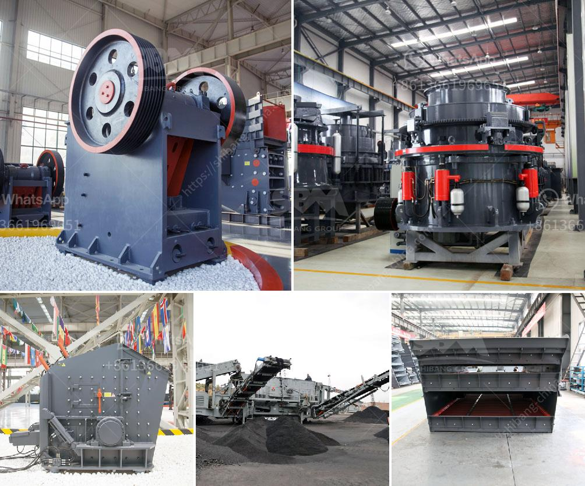

<h3>stone crushing machine in kenya</h3>
Stone crushing machine is used to crush large-sized rocks into fragments or gravels. Crushing stones is common in Kenya. It is performed using machinery such as a stone crusher, which crushes the stones into various sizes for use in the construction industry.

Stone crushing machines in Kenya are used for crushing rocks extracted from quarries. These rocks are then used for road construction, building materials, construction projects, and other uses.

The purpose of crushing the stones is to reduce their size and ensure that they can be used effectively. The crushing process is carried out using various stone crushers. The machines used include jaw crushers, gyratory crushers, cone crushers, and impact crushers.

Jaw crushers are commonly used machines in aggregate production due to their versatility. They can crush different types of materials, including hard rocks and ores. They are designed to produce a consistent size of crushed stones.

Gyratory crushers are often used for primary crushing when the raw materials are large-sized. They operate by compressing the material between a stationary and a rotating surface.

Cone crushers are used to crush rocks into smaller sizes. They work by squeezing the material between an eccentrically gyrating spindle and a concave bowl.

Impact crushers are used to break down hard rocks. They work by using a high-speed rotating rotor, which creates an impact force. This force breaks down the rocks into smaller sizes.

Stone crushing machines in Kenya are often used in aggregate production to create smaller-sized rocks for the construction industry. The rocks are run through a primary crusher and then through secondary crushers to produce different-sized products.

When the stones are crushed, they are screened into different sizes. This screening process is important for producing a product that meets the required specifications. It ensures that the stones can be used effectively in construction projects.

Stone crushing machines in Kenya are widely used in the mining industry for processing all kinds of materials such as limestone, granite, mica, iron ore, copper ore, and gold ore. They are designed for heavy-duty applications and are capable of crushing rock with a compressive strength of up to 400 MPa.

Stone crushing machines in Kenya can be used to crush stones into small sizes or even into fine dust. The stone crusher machine for sale is always used in the first processing stage for dealing with the large size raw materials.

When the materials are processed into required size for the next processing stage, they are sent to other mining machines for further processing, such as grinding mills, beneficiation machines, and flotation machines.

Stone crushing machines in Kenya can be used to crush stones into different sizes. The crushing plant designed by the FTM company can process a variety of materials, such as limestone, granite, pebbles, etc. It can crush various types of ores and stones such as basalt, quartz, limestone, etc.

The stone crushing equipment is reliable and durable, with high crushing efficiency and low energy consumption. Moreover, the crushing equipment is flexible and easy to operate.

In conclusion, stone crushing machines in Kenya are used widely in the mining industry for processing all kinds of materials. They can be used for crushing stones into small sizes or even into fine dust. These machines are popular in Kenya due to their high productivity, low energy consumption, and easy operation. They are necessary machines in the construction industry for making concrete and other building materials.
<h3>Contact us</h3><ul><li><strong>Whatsapp:&nbsp;<a href="https://wa.me/8613661969651">+8613661969651</a></strong></li><li><a href="https://swt.shibang-china.com/?git&amp;zhl&amp;stone crushing machine in kenya"><strong>Online Service(chat now)</strong></a></li></ul><h3>Related</h3><ul><li><a href='roller crusher for sale gumtree.md'>roller crusher for sale gumtree</a></li><li><a href='price of grinding machine for europe.md'>price of grinding machine for europe</a></li><li><a href='industrial grinder fine powder.md'>industrial grinder fine powder</a></li><li><a href='crushing equipment in south africa.md'>crushing equipment in south africa</a></li><li><a href='small impact crusher 100 mesh.md'>small impact crusher 100 mesh</a></li></ul>