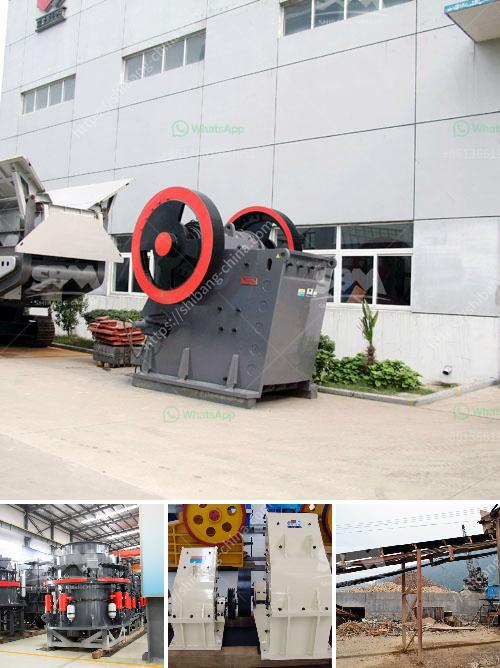

<h3>stone crushing machine manufacturers</h3>
Stone crushing machine manufacturers have evolved over the years and are now a leading global supplier of crushing equipment, providing solutions for the mining and construction industries.

The nature of the stones to be crushed in the stone crushing plant necessitates a substantial fleet of crushing machines. On the market, there are various types of crushers that can be utilized depending on the crushing needs. The primary crushers are always the first ones to reduce the big stones into smaller ones.

Vertical impact crushers, jaw crushers, cone crushers, and hammer crushers are the most popular types of crushing machines with varying specifications. Each type is designed to serve a specific purpose and designed to be used for specific applications.

One of the key factors that have led to the success of stone crushing machine manufacturers is the ability to cater to specific customer requirements. For instance, different crushers have different capacity levels, making some more efficient for specific applications. Some crushers can crush rocks up to 500 millimeters in size, while others are designed to work with stones smaller than 200 millimeters in diameter.

Stone crushing machine manufacturers have different types of crushing machines in their product lineup. Some manufacturers specialize in producing machines that are hydraulically operated. By using hydraulic systems, the machines can crush rocks with much higher efficiency and more consistency compared to manually operated crushers.

Other manufacturers focus on machines powered by diesel engines, which provide great flexibility in terms of the location of the crushing plant. Diesel engines are also known for their reliability and low maintenance requirements, making them a popular choice for remote areas where electricity supply may be limited.

Apart from the type of crushing machines, another factor that stone crushing machine manufacturers take into consideration is the feed capacity. Higher capacity crushers are preferred in large-scale mining and construction projects, where several hundred tons of rocks need to be crushed daily.

Stone crushing machine manufacturers also take environmental considerations into account when designing their machines for crushing purposes. Stone crushing plants utilize a variety of machines that operate with greener technologies, such as hybrid power systems that run through electric motors, helping to lower fuel consumption and reduce carbon emissions.

Overall, stone crushing machine manufacturers provide the highest quality crushing machines to their customers, ensuring maximum efficiency and productivity even in the most challenging environments. With a wide range of models available, these manufacturers can help businesses of all sizes choose the right machines for their specific needs.

In conclusion, stone crushing machine manufacturers have evolved and developed innovative crushing machines that cater to specific customer requirements. These manufacturers provide efficient and reliable crushing equipment for the mining and construction industries, helping businesses increase productivity and achieve their goals while minimizing the impact on the environment.
<h3>Contact us</h3><ul><li><strong>Whatsapp:&nbsp;<a href="https://wa.me/8613661969651">+8613661969651</a></strong></li><li><a href="https://swt.shibang-china.com/?git&amp;zhl&amp;stone crushing machine manufacturers"><strong>Online Service(chat now)</strong></a></li></ul><h3>Related</h3><ul><li><a href='sell european stone crusher.md'>sell european stone crusher</a></li><li><a href='mobile quarry crusher euipment.md'>mobile quarry crusher euipment</a></li><li><a href='jual stone crusher mobile cap 30 tph in indonesia.md'>jual stone crusher mobile cap 30 tph in indonesia</a></li><li><a href='mobile crusher plant price in india.md'>mobile crusher plant price in india</a></li><li><a href='quartz crushers price in india.md'>quartz crushers price in india</a></li></ul>