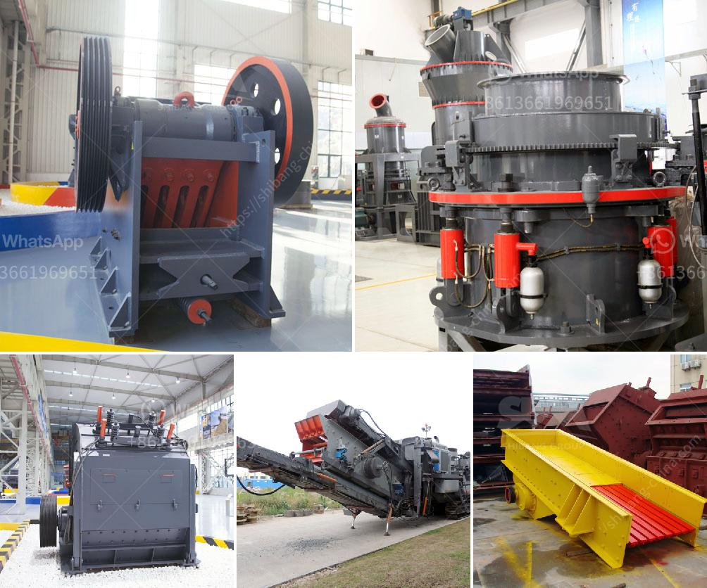

<h3>stone crushing machine suppliers</h3>
In today's mining and construction industry, countless small and large-sized machines help accomplish various tasks efficiently. These machines are necessary for breaking down stones into smaller, more manageable pieces - a task that would otherwise be impossible without the assistance of specialized equipment. Stone crushing machines are widely used in limestone rock mining crushing plant, sand making plant, mineral processing plant and so on. These machines can process a wide range of materials, regardless of their hardness or abrasiveness.

When choosing the right crushing machine supplier, it is essential to consider several factors that may greatly influence the overall performance of the plant. A reliable supplier will provide high-quality machines that can meet the production demands, provide excellent after-sales support, and offer competitive prices. Yet finding such a supplier can be a daunting task, as the market is flooded with various options. Here are some key points to keep in mind when evaluating stone crushing machine suppliers.

First and foremost, it is important to ensure that the supplier has a strong reputation in the industry. One way to do this is by researching the supplier's background and reading customer reviews. A reputable supplier will have positive feedback from satisfied customers, proving their commitment to delivering high-quality machines. Additionally, it is advisable to choose a supplier who has been in the industry for a significant period as they are likely to have extensive experience and expertise.

Secondly, it is essential to consider the quality of the machines offered. Quality should never be compromised when it comes to stone crushing machines as they are subjected to heavy workloads and harsh environments. The supplier should have machines that are made with durable materials and are built to withstand constant use. High-quality machines will not only ensure efficient production but also minimize the need for frequent repairs and replacements, reducing downtime and saving costs in the long run.

Furthermore, the supplier's after-sales support is crucial in maximizing the value of the machines. A reliable supplier should provide comprehensive support, including installation guidance, training for operators, and timely maintenance and repair services. This support will help optimize the machines' performance and extend their lifespan. Additionally, a supplier who can provide spare parts and quick replacements will minimize downtime in case of unexpected failures.

Lastly, competitive pricing is another factor to consider. It is important to compare prices from different suppliers to ensure that you are getting the best value for your investment. However, it is crucial to remember that quality should never be compromised for the sake of lower prices. Always choose a supplier who strikes the right balance between affordability and quality.

In conclusion, selecting the right stone crushing machine supplier is crucial for the overall success of your project. Consider their reputation, the quality of their machines, after-sales support, and pricing when making your decision. By choosing a reliable supplier, you can ensure that the machines meet your production demands, operate smoothly, and provide a satisfactory return on your investment.
<h3>Contact us</h3><ul><li><strong>Whatsapp:&nbsp;<a href="https://wa.me/8613661969651">+8613661969651</a></strong></li><li><a href="https://swt.shibang-china.com/?git&amp;zhl&amp;stone crushing machine suppliers"><strong>Online Service(chat now)</strong></a></li></ul><h3>Related</h3><ul><li><a href='roll crushers for rent.md'>roll crushers for rent</a></li><li><a href='dolomite production.md'>dolomite production</a></li><li><a href='crushing equipment for rent.md'>crushing equipment for rent</a></li><li><a href='rock crushing price.md'>rock crushing price</a></li><li><a href='jaw crusher discount.md'>jaw crusher discount</a></li></ul>