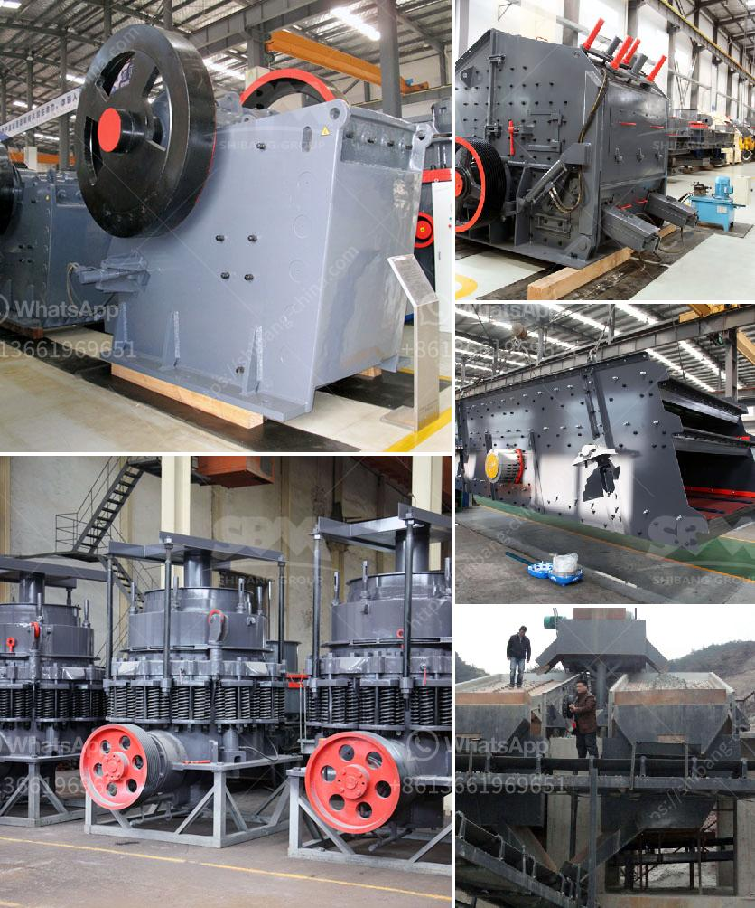

<h3>stone crushing machinery suppliers</h3>
Stone crushing machinery is an indispensable equipment for crushing plant. If you want to invest a sand and gravel processing plant, the purchase of crushing machinery is a more important process. It requires the investment budget for the production of machinery, and the equipment and manufacturers should be reasonably selected; Next, let's take a look at the more common types of stone crusher equipment.

Jaw crusher is the most common type of crusher equipment in mining industry, because it has a simple structure, reliable performance, and easy maintenance, jaw crusher is widely used for different projects in the Philippines. In general, you can use the jaw crushers in the stage of coarse crushing to crush granite, marble, basalt, limestone, quartz, river pebbles, iron ore, copper ore, and other materials. You can put the materials, size between 1500 and 500mm into the jaw crusher equipment.

Then you can get the smaller materials, about the size between 400 to 125mm. In recent years, in order to meet the requirement of crushing high hardness materials and different customer needs, we can get various types shape of final products, such as, block type, ball type, flow type, etc. comparison of several commonly used stone crushing machinery. Compared with the jaw crusher plant, the feed size is usually limited to less than 1000mm and the crushing capacity is usually less than 5000 tons per hour.

As with the jaw crusher, material travels downward between the two surfaces being progressively crushed until it is small enough to fall out through the gap between the two surfaces. This type of crusher has a long history and belongs to traditional crushing equipment. Its motor drives the eccentric shaft to rotate via V-belt pulley and movable jaw to carry out a periodical complex pendular movement to generate crush capacity.

An impact crusher is also called impactor which is mainly used in crushing plant for stone crushing. In the crusher plant, it is more commonly used in aggregate crushing plant, mine equipment and concrete crushing plant. The horizontal shaft impact crusher is a high production equipment of the current crusher, but the grain size of the stone is better and the output is higher. It can crush the material with the compressive strength of not more than 350Mpa.

When it comes to the best stone crushing machinery suppliers in the market, they should have a comprehensive understanding of manufacturing stones and the supply chain. The suppliers should categorize the stones they provide, along with their specific uses. They should also be experts in various types of crushing equipment and should have a wide range of options available to cater to different customer needs. Additionally, reliable suppliers should have a strong reputation for delivering high-quality machinery and providing excellent customer service.

In conclusion, stone crushing machinery suppliers play a crucial role in the production of stone crusher equipment. They provide the necessary equipment and machinery required for efficient stone crushing. Choosing a reliable supplier will ensure that the equipment used is of the highest quality and performs optimally, leading to increased productivity and profitability for the crushing plant.
<h3>Contact us</h3><ul><li><strong>Whatsapp:&nbsp;<a href="https://wa.me/8613661969651">+8613661969651</a></strong></li><li><a href="https://swt.shibang-china.com/?git&amp;zhl&amp;stone crushing machinery suppliers"><strong>Online Service(chat now)</strong></a></li></ul><h3>Related</h3><ul><li><a href='malaysia raymond mill.md'>malaysia raymond mill</a></li><li><a href='ball mills in solidwork.md'>ball mills in solidwork</a></li><li><a href='mini stone crusher for sale.md'>mini stone crusher for sale</a></li><li><a href='crusher plant suppliers in saudi arabia.md'>crusher plant suppliers in saudi arabia</a></li><li><a href='mobile crusher price algerie.md'>mobile crusher price algerie</a></li></ul>