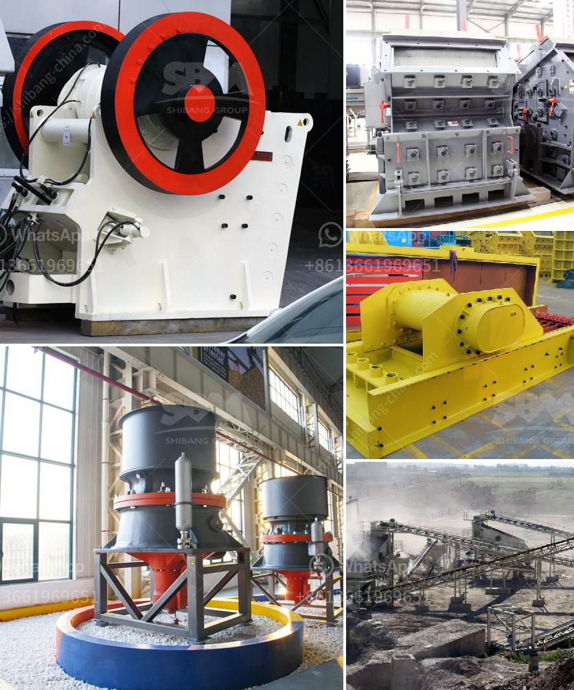

<h3>stone crushing machines for sale</h3>
Stone crushing machines are used in a number of areas, such as construction materials, mining, metallurgy, forests, research and railroads, and so on. In the light of the need set out by the method of construction activity, e.g. walkways, sidewalks, roads, buildings and extensions, and so on.

Stone crushing machines are essential equipment in the mining and construction industry. Various types of stone crushers are used for crushing business in mine quarrying and construction industry. Some popular locations to get in touch with reliable stone crusher manufacturers are Nigerian, Australian, Saudi Arabia, India, Indonesia, South Africa, Canada, UK, Dubai, US, Ghana, etc.

3. Cone crusher: This crusher is used to crush the stone into smaller particle sizes for secondary crushing purposes.

4. Vibrating screen: The circular vibrating screen separates the stones into various sizes for further processing.

5. Belt conveyor: This is the final stage in the crushing process where the stone is moved from the conveyor belt to the vibrating screen.

1. Cost: The cost of the machine plays a crucial role in making a buying decision. The price of the equipment should not exceed your budget. Consider buying from manufacturers that offer competitive prices without compromising on quality.

2. Quality: When it comes to stone crushing machines, reliability and durability are essential. Look for machines made from high-quality materials and components that can withstand the harsh working conditions in mining and construction sites.

3. Output Capacity: The output capacity of the crusher determines the efficiency and productivity of the machine. Consider the amount of material the machine can process per hour and choose one that matches your production needs.

4. Maintenance and Service: Regular maintenance is crucial to keep the machine running efficiently and smoothly. Look for machines that come with a comprehensive after-sales service package, including maintenance and repair services.

5. Power Consumption: Energy efficiency is another important factor to consider. Look for machines that consume less power while delivering high performance. This not only reduces your energy bills but also helps in reducing environmental impact.

6. Safety Features: Ensuring the safety of the operators is paramount. Look for machines that come with safety features like emergency shut-off buttons and protective guards to prevent accidents.

7. Ease of Use: Choose a machine that is user-friendly and easy to operate. Machines with intuitive controls and clear instructions make it easier for the operators to handle the equipment.

8. Warranty: A good warranty is an indication of the manufacturer's confidence in the quality and reliability of their product. Look for machines that come with a comprehensive warranty that covers manufacturing defects.

In conclusion, stone crushing machines for sale are essential for the construction, mining, and quarrying industries. The key factors to consider when choosing a crusher include affordability, quality, output capacity, maintenance requirements, power consumption, safety features, and ease of use.
<h3>Contact us</h3><ul><li><strong>Whatsapp:&nbsp;<a href="https://wa.me/8613661969651">+8613661969651</a></strong></li><li><a href="https://swt.shibang-china.com/?git&amp;zhl&amp;stone crushing machines for sale"><strong>Online Service(chat now)</strong></a></li></ul><h3>Related</h3><ul><li><a href='mica grinding mill.md'>mica grinding mill</a></li><li><a href='industrial application ball mill.md'>industrial application ball mill</a></li><li><a href='coal crusher machine manufacturers.md'>coal crusher machine manufacturers</a></li><li><a href='price stone crusher in nigeria.md'>price stone crusher in nigeria</a></li><li><a href='plans for making a miniature jaw crusher.md'>plans for making a miniature jaw crusher</a></li></ul>