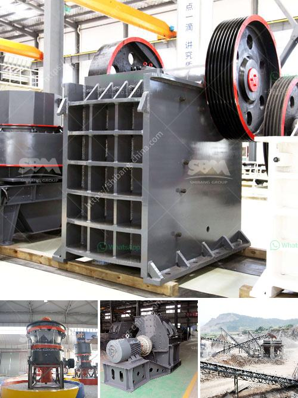

<h3>stone crushing plant 100tph for sale</h3>
Stone crushing plant is a specialized production line aimed to produce building sand and stone, saving 50% energy than traditional stone production line. It enables the rock, sand and gravel, cobble and other materials to be made into various granularities conformed to the requirements of building sand. Moreover, this production line is highly automatic, low power consumption, and high efficiency. 

The stone crushing plant 100tph is suitable for medium-sized and small-scale projects. It plays an important role in the crushing of various ores and bulk materials. The machine is used for the crushing of various Scraps, Metal Waste, Cutting Machine, etc. They are ideal equipment for crushing plants. The 100tph stone crusher plant includes jaw crusher, cone crusher, vibrating screen, belt conveyor, hopper, vibrating feeder, control system, and so on.

40-60 tph stone crushing plant includes vibrating feeder, jaw crusher, impact crusher or cone crusher, vibrating screen, belt conveyor and centrally electric controlling system, etc. The designed capacity is from 40t/h to 600t/h. To meet customer's specific requirement for the stone crushing, we can also add other equipments such as cone crusher, dust catcher on the crushing plant. Process of productio...

In the stone crushing plant, stone crushers consist of stone jaw crusher, stone cone crusher, stone impact crusher, and VSI sand maker for sale, all of these stone crushing equipment for sale can be applied in different aggregate crushing plant with different types of configurations.

SBM 100TPH stone crushing plant mainly consists of vibrating feeder, jaw Crusher, cone Crusher or impact Crusher, vibrating screen, belt conveyor and control system, etc. It is completely capable to crush and screen limestone, marble, granite, basalt, river stone, and so on.

Thirdly, the stones which meet requirement of finished products will be transferred to finished products pile, while the others will be sent back to cone crusher or impact crusher by belt conveyor for crushing again. In this way the closed-circuit cycles are formed. According to clients' requirements, the discharging size can be adjusted for different crushed material.

This 100tph stone crushing plant for sale can be widely used as sand making line, rock crushing line, stone crushing plant, ore dressing line, aggregate production line, construction waste recycling plant and so on. For the contractors and final users, SBM Machinery has designed complete stationary, portable, mobile crushing plants. 

The 100tph capacity stone crusher plant is the best choice for medium scale stone crushing operations. SBM committed to providing customers with the best technology, processing equipment and services to ensure an efficient and profitable operation. Why choose 100 tph stone crushing plant for sale in Philippine? 

The main reason is that SBM 100tph stone crushing plant adopts advanced production technology and equipment. Compared with traditional stone crushing plant, SBM 100tph stone crushing plant brings more profits to customers.

The 100tph stone crushing plant is an integral part of the stone crushing industry. It is a complete solution for stone crushing needs. 100tph stone crushing plant consists of vibrating feeder, jaw crusher, cone crusher or impact crusher, vibrating screen, belt conveyor and panel controls.

The 100tph stone crushing plant is suitable for small, medium and large scale crushing applications. Cone crushers are known for their ability to produce finely crushed stone products with a cubical shape. The cone crusher is best suited for secondary crushing or tertiary crushing applications where the feed material is required to be crushed between the concave and mantle. 

In conclusion, the stone crushing plant designed by SBM Machinery is highly automated, low-cost, high-yielding, energy-saving, and environmentally friendly. It can crush all kinds of stones, such as limestone, granite, basalt, river pebble, copper ore, iron ore, etc. Now, if you are interested in our stone crushing plants or have any questions, please contact us for free consultation.
<h3>Contact us</h3><ul><li><strong>Whatsapp:&nbsp;<a href="https://wa.me/8613661969651">+8613661969651</a></strong></li><li><a href="https://swt.shibang-china.com/?git&amp;zhl&amp;stone crushing plant 100tph for sale"><strong>Online Service(chat now)</strong></a></li></ul><h3>Related</h3><ul><li><a href='rotary kilns in indonesia.md'>rotary kilns in indonesia</a></li><li><a href='gold mining mining gold mining cost.md'>gold mining mining gold mining cost</a></li><li><a href='roller mill machine for mining.md'>roller mill machine for mining</a></li><li><a href='stone crushing machines for sale.md'>stone crushing machines for sale</a></li><li><a href='small mobile stone crushers.md'>small mobile stone crushers</a></li></ul>