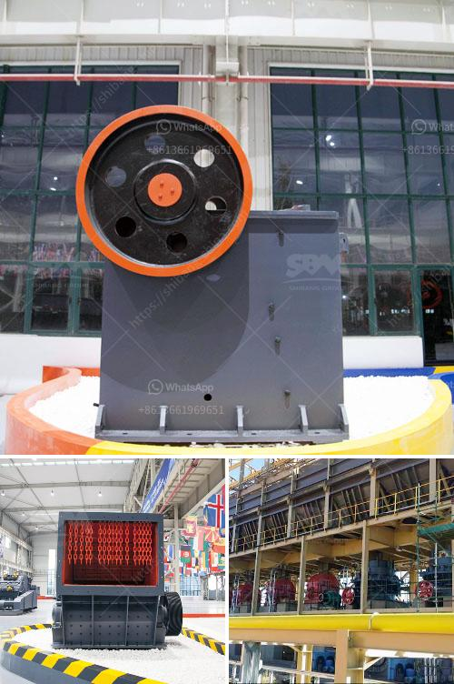

<h3>stone crushing plant business plan</h3>
Stone crushing is a specialized business that requires an understanding of the industry and its intricacies. Crushed stone is used as raw material for various construction activities such as construction of roads, bridges, buildings, canals, etc. It is an essential equipment in an industry where stone is crushed and sorted into different sizes. It is also used in cement production and various other purposes.

Stone crushing plant is a profitable venture for new entrepreneurs. The demand for quality stone chips is increasing day-by-day. Stone Crusher Plant Market Opportunity

All the building constructions whether it is housing or industrial construction activities requires crushed stone. Crushed stone is also required for cement based products like RCC pipes, PSC poles, cement concrete hollow blocks, precast cement concrete slabs, well rings, window & door frames and road laying

The demand for crushed stone will continue to grow with the growth of its user industry. One of the most particular and general but most important materials used for making concrete is stone chips.

First of all, break the big stone boulders to smaller size manually. Then it is fed to the stone crusher. The crusher can accept the stone size of 175mm. Stone crushing is the two-stage process. In the first stage, crush the 175mm stone to about 50mm. Thereafter, fit the crusher with a conversion kit to enable granulation of 5 to 20mm. Then screen the crushed material by the rotary screen. Unit location is a major factor for stone crusher plant business.

In order to successfully set up a stone crushing plant, you need to make a complete business plan and project report for stone crushing plant. This can potentially save you some serious time and money! Here will show you how to manage a stone crushing plant in quarry operation.

The stone crusher project report deals with the production and use of stones for producing manufactured sand, which is defined as aggregate material less than 4 mm, processed from crushed rock or gravel, intended for construction use.

The motivation for this project is the increased miss balance between the need for aggregates in the society and the need to develop concept solutions for the use of manufactured sand as concrete aggregate.

The detailed project reports cover all the aspects of business, from analyzing the market, confirming availability of various necessities such as plant & machinery, raw materials to forecasting the financial requirement. If you need the details of the stone crusher project report, please contact us.

These are the oldest type of and most commonly used crushers in use and have changed little from the original design. In Jaw Crusher the feed is compressed between a stationary and a movable surface.

The impact crusher is commonly used for the crushing of limestone, coal, calcium carbide, quartz, dolomite, iron pyrites, gypsum, and chemical raw materials of medium hardness.

Cone crusher is widely used in mining, metallurgy, building materials, chemicals and other sectors to crush hard and medium hard materials.
<h3>Contact us</h3><ul><li><strong>Whatsapp:&nbsp;<a href="https://wa.me/8613661969651">+8613661969651</a></strong></li><li><a href="https://swt.shibang-china.com/?git&amp;zhl&amp;stone crushing plant business plan"><strong>Online Service(chat now)</strong></a></li></ul><h3>Related</h3><ul><li><a href='jaw crusher for sale ton per hour.md'>jaw crusher for sale ton per hour</a></li><li><a href='crushers price in south africa product.md'>crushers price in south africa product</a></li><li><a href='belt conveyor untuk batubara.md'>belt conveyor untuk batubara</a></li><li><a href='grinding ball mills type p500.md'>grinding ball mills type p500</a></li><li><a href='concrete stone crusher uk for sale.md'>concrete stone crusher uk for sale</a></li></ul>