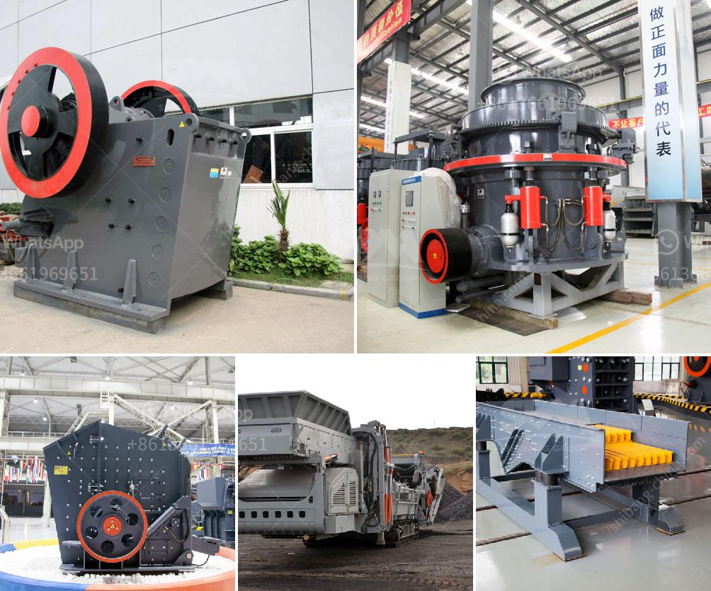

<h3>stone crushing plant in pakistan</h3>
Stone crushing plant is one-stop crushing installation, which can be used for rock crushing, garbage crushing, building materials crushing and other similar operations. Crushing plants may be either fixed or mobile, depending upon your requirements. It has different stations to provide maximum efficiency in work. The crushing plants are beneficial for bringing substantial development opportunities, improving local economies, creating jobs and reducing poverty.

Pakistan has rich deposits of various minerals including coal, copper, gold, chromite, mineral salt, bauxite and several other minerals. There are also a variety of precious and semi-precious stones that are found in Pakistan. Stone crushing plant is used to crush stones of various sizes or change the form such as limestone, quartz, marble, granite and recycle building waste materials such as debris, asphaltic cement concrete and many more. This stone crushing plant can be applied to crush and recycle various mineral stones and bulk materials into fine particles.r 

The stone crushing plant can also be used to produce different sizes of crushed stone for construction projects, railway ballasts, and other uses. The crushing plant includes a variety of equipment such as vibrating feeder, jaw crusher, cone crusher, impact crusher, vibrating screen, belt conveyor, etc. It is designed with flexible configurations and can be operated independently or in conjunction with other machines according to different production requirements.

In recent years, the demand for stone crushing plants in Pakistan has increased significantly due to various infrastructure development projects. Pakistan government has initiated several mega infrastructure projects to improve the country's transportation network, such as the Metro Bus project and the China-Pakistan Economic Corridor (CPEC). These projects require a large amount of high-quality crushed stone, which creates a positive market for stone crushing plant manufacturers and suppliers in Pakistan.

The stone crushing plant industry is indeed a thriving sector that provides valuable opportunities for both large and small-scale stone crushing businesses. Potential entrepreneurs can set up their own crushing plants to meet the growing demand for stone materials in construction projects and other applications. The market potential is huge as infrastructure development projects continue to be implemented across the country.

In conclusion, stone crushing plant is a promising investment and a valuable business opportunity for anyone who is looking to invest in the stone crushing industry. It is essential for the government and other stakeholders to ensure that adequate support and incentives are provided to help the industry flourish and contribute to Pakistan's economic growth.
<h3>Contact us</h3><ul><li><strong>Whatsapp:&nbsp;<a href="https://wa.me/8613661969651">+8613661969651</a></strong></li><li><a href="https://swt.shibang-china.com/?git&amp;zhl&amp;stone crushing plant in pakistan"><strong>Online Service(chat now)</strong></a></li></ul><h3>Related</h3><ul><li><a href='recycled concrete manufacturers in shanghai.md'>recycled concrete manufacturers in shanghai</a></li><li><a href='feldspar crusher price.md'>feldspar crusher price</a></li><li><a href='mobile crusher sale germany.md'>mobile crusher sale germany</a></li><li><a href='roller conveyor belts.md'>roller conveyor belts</a></li><li><a href='50 tph stone crusher plant price.md'>50 tph stone crusher plant price</a></li></ul>