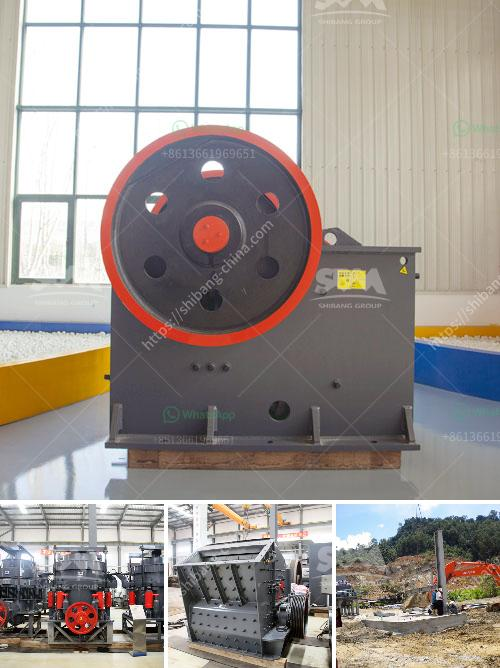

<h3>stone crushing plant price</h3>
Stone crushing industry is an important industrial sector in the country. The crushed stone is then used as raw material for various construction activities i.e. construction of roads, bridges, buildings and canals. Over the last 10 years, the construction sector has been registering strong growth rates in the range of 7-8%. Consequently, there is an urgent need to explore alternative materials to varied aggregates available in the market in order to stabilize cost of construction. The crushed stone industry is highly capital intensive and requires substantial investment in plant setup to ensure its efficient functioning.

The stone crushing plant price is determined by various factors, such as equipment type, capacity, raw materials, and planned output quantity. Different factors have different impact on the stone crusher plant price. Some factors like market demand and supply, changes in government regulations, policies, trade barriers, and technical progress affect the stone crushing plant price.

The stone crushing industry has been growing rapidly due to increasing demand from the construction industry and other sectors. With the growing infrastructure development in various parts of the country, there is a constant demand for crushed stones for construction purposes. This has led to a significant increase in the prices of stone crushing plants.

The price of a stone crushing plant varies depending on the capacity, brand, location, and many other factors. However, there are some common factors that affect the price of stone crushing plants.

Firstly, the raw material used in the plant. The raw materials used in the stone crushing plant include limestone, granite, basalt, and river stone. These materials have different hardness, granularity, and abrasion resistance, which will affect the plant price.

Secondly, the capacity of the plant. Stone crushing plants with different capacities can meet different clients' demands. If you need a high capacity plant, you may have to pay a higher price. However, it also means that the plant can produce more stones, which can generate higher profits.

Lastly, the brand and reputation of the plant. Different brands and manufacturers have different pricings. Some well-known brands have established a good reputation in the industry, providing reliable and high-quality stone crushing plants. Their prices may be higher due to the premium brand value and customer trust.

In conclusion, the price of a stone crushing plant is determined by various factors, including the capacity, raw materials, market demand, and brand reputation. It is crucial for buyers to consider these factors before making a purchasing decision, as it can greatly impact their investment and the success of their construction projects.
<h3>Contact us</h3><ul><li><strong>Whatsapp:&nbsp;<a href="https://wa.me/8613661969651">+8613661969651</a></strong></li><li><a href="https://swt.shibang-china.com/?git&amp;zhl&amp;stone crushing plant price"><strong>Online Service(chat now)</strong></a></li></ul><h3>Related</h3><ul><li><a href='vibrating screen design products from philippines.md'>vibrating screen design products from philippines</a></li><li><a href='quarry plant for sale south africa.md'>quarry plant for sale south africa</a></li><li><a href='rock crushers tonne per hour.md'>rock crushers tonne per hour</a></li><li><a href='nigeria rock crusher for sale.md'>nigeria rock crusher for sale</a></li><li><a href='micron grinding unit menufacture plant in bewar.md'>micron grinding unit menufacture plant in bewar</a></li></ul>