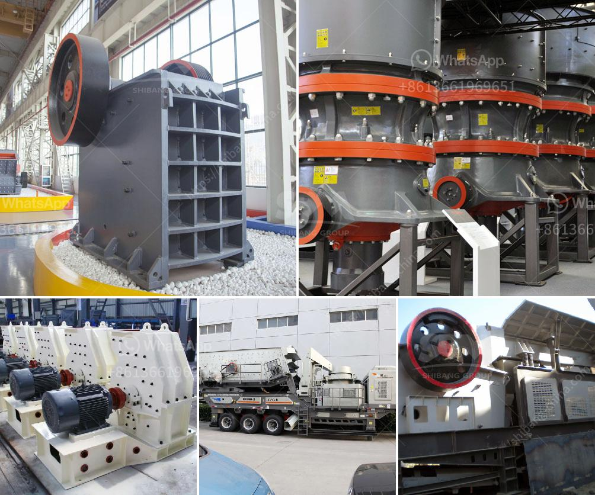

<h3>stone crushing plant project report</h3>
The infrastructure and construction industry is thriving nowadays due to the rapid urbanization and increase in population. Therefore, there is a huge demand for stones and aggregates for construction purposes. Stone crushing plant is an efficient crushing plant that produces high quality aggregates. With the increasing demand of high-quality stones, the stone crushing plant project report is essential. The complete crushing plant project report includes everything from analyzing the market, confirming availability of various necessities such as plant & machinery, raw materials to forecasting the financial requirements.

The scope of the report includes assessing market potential, negotiating with collaborators, investment decision making, corporate diversification planning etc. in a very planned manner by formulating detailed manufacturing techniques and forecasting financial aspects by estimating the cost of raw material, formulating the cash flow statement, projecting the balance sheet etc. Stone crushing plant project report is to require a comprehensive, systematic analysis of the main methods of economic efficiency as the core, a variety of factors surrounding the impact crusher project, the use of large amounts of data demonstrate the feasibility of the proposed project.

Feasibility study for the entire Crusher Comprehensive analysis and evaluation, pointing out strengths and weaknesses. Studies have identified a range of effects, including construction supervision and inspection services settlement, transport, factory audits, equipment procurement compliance, field review, and advisory services hydraulic equipment machinery and construction supervision.

The stone crushing plant employs many people both skilled and unskilled who are involved in the entire process of mining, crushing and transportation of the crushed stone. The plant’s ideal location is supposed to be near growing towns or cities so as to supply the demand for the stone and at the same time near the source to the stone to be crushed.

Hard Lime Stone is the basic raw material which is used for the production of quality crushed stone. The market is continuous developing with continuous increase in demand for construction materials such as roadbase, construction fill, concrete aggregates and asphalt for highways, rural roads, looking for investors, and valley fill tailings dams. This part provides a summary of these trends and discusses the implications for the HPA. The prediction of the HPA is presented on the basis of the actual record of the growth rate of major producers (representing approximately 30% of total capacity), and HPA capacity similarly tailored to inventories,.

In conclusion, the stone crushing plant project report lists the strengths and weaknesses of a project as well as possible solutions to these challenges in order to attract potential investors. With the understanding of the business opportunities and the need for high-quality construction materials, the stone crushing plant project report signifies the prospects of setting up a profitable stone crushing plant.
<h3>Contact us</h3><ul><li><strong>Whatsapp:&nbsp;<a href="https://wa.me/8613661969651">+8613661969651</a></strong></li><li><a href="https://swt.shibang-china.com/?git&amp;zhl&amp;stone crushing plant project report"><strong>Online Service(chat now)</strong></a></li></ul><h3>Related</h3><ul><li><a href='material of sectional conveyor belts.md'>material of sectional conveyor belts</a></li><li><a href='roller mill process machine.md'>roller mill process machine</a></li><li><a href='stone crushing plants of japanese technology.md'>stone crushing plants of japanese technology</a></li><li><a href='india copper mining equipment.md'>india copper mining equipment</a></li><li><a href='uk made stone crushing machine.md'>uk made stone crushing machine</a></li></ul>