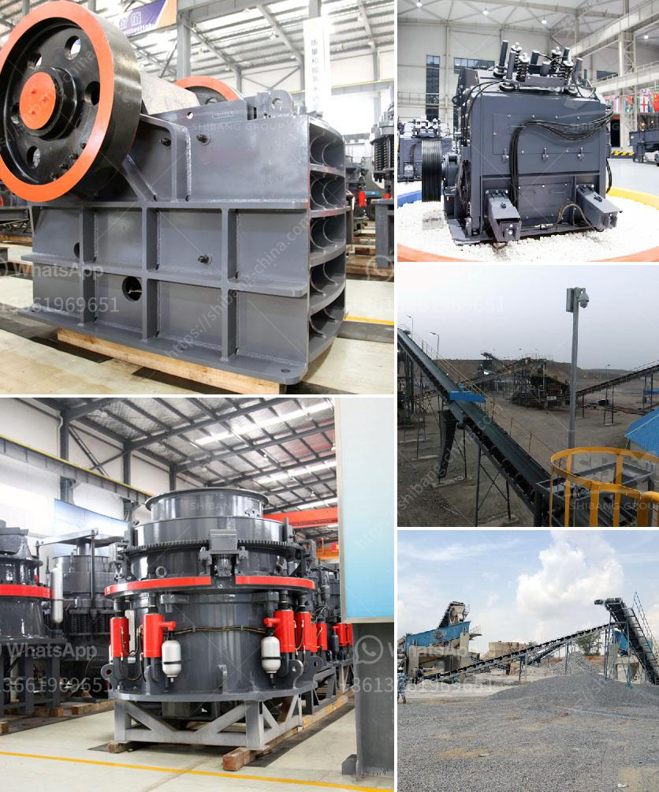

<h3>stone crushing plant sale</h3>
Stone crushing plant is the combination of stone, sand and building materials or industrial materials manufacturing equipment, which is also called stone crusher plant or stone production line. It is mainly composed of vibrating feeder, jaw crusher, impact crusher or cone crusher, circular vibrating screen, belt conveyor, centralized electric control, etc. The designed output is generally 50-800t/h, and it can be equipped with other products or tailored according to different requirements.

Stone crushing plant is widely used in mining, smelting, building materials, roads, railways, water conservancy and chemical industry, and many other industries. The stone crusher is suitable for crushing and shaping of stone materials with different hardness, be widely used in a variety of minerals, cement, refractories, aluminum, diamond sand, glass raw materials, mechanism building sand, stone and a variety of metallurgical slag, especially to the hard and wear-resistant materials, such as silicon carbide, diamond sand, sintered bauxite, higher efficiency than other types of crushers.

Stone crusher plant sale is accompanied with the booming demand for infrastructure construction aggregate, which is additionally promoted by infrastructure construction. Coupled with the increasing infrastructure construction, stone crushing plant is also popular in some areas. The stone crushing plant sale is the new generation product designed and produced by SBM, basing on our 30 year's crusher production experience and the latest design conception. It does be one high efficiency and low cost crushing machine.

Stone crushing plant has the advantages of high production efficiency, low operating cost, large output, high-yielding, uniform finished product size, good grain shape, less powder, and so on. While this is the only machine that can reach urban construction sites, it is indispensable in today's urban construction. In a word, it can be said that the stone crushing plant has the important role in the whole construction process.

Overall, the stone crushing plant is a good investment choice for construction aggregate and there are more and more clients applying it in road and bridge construction and raw material crushing. With the booming development of construction industry, the demand for stone products contributes to the rapid development of stone crushing plant equipment.
<h3>Contact us</h3><ul><li><strong>Whatsapp:&nbsp;<a href="https://wa.me/8613661969651">+8613661969651</a></strong></li><li><a href="https://swt.shibang-china.com/?git&amp;zhl&amp;stone crushing plant sale"><strong>Online Service(chat now)</strong></a></li></ul><h3>Related</h3><ul><li><a href='cost of small scale cement factory.md'>cost of small scale cement factory</a></li><li><a href='ball mill manufacturer india.md'>ball mill manufacturer india</a></li><li><a href='cement stone crusher for sale.md'>cement stone crusher for sale</a></li><li><a href='ball mill procedure in practical.md'>ball mill procedure in practical</a></li><li><a href='ball mill india.md'>ball mill india</a></li></ul>