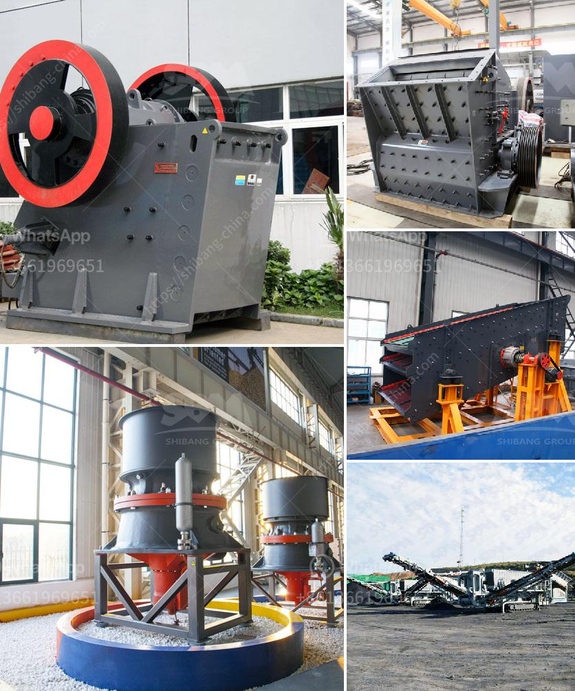

<h3>stone crushing plant th hard rock</h3>
Stone crushing plant is the most commonly used crushing equipment in mining industry. It is mainly used to crush hard rock, such as granite, basalt, pebble and so on. The main minerals processed by the stone crushing plant are concrete aggregate and road stone. The stone crushing plant is equipped with different crushing equipment to meet the different crushing process requirements of customers.

The stone crushing plant is widely used in construction, highway, railway, mining and other industries for crushing various materials. The main equipment usually includes jaw crusher, impact crusher, cone crusher, hammer crusher and other equipment. It is mainly used to crush large pieces of stone into smaller particle size for further processing.

This stone crushing plant has high automation degree, low operating cost, high crushing efficiency, energy saving, large output, less pollution and easy maintenance. The finished products, such as gravel, sand and aggregate, are in line with the national construction standards, which are widely used in construction, road and railway industries.

The stone crushing plant can be customized according to the specific requirements of customers. Different crushing equipment can be selected according to the hardness, size and output of the stone. The production capacity of the stone crushing plant ranges from 50t/h to 800t/h, which can be used for medium-sized and large-scale stone crushing production.

In conclusion, the stone crushing plant is a good investment choice for construction, highway, railway, mining and other industries. It provides customers with reliable, efficient and cost-effective crushing equipment. With the continuous development of construction industry, the demand for stone crushing plant is increasing, which creates a huge market opportunity for the stone crushing plant industry.
<h3>Contact us</h3><ul><li><strong>Whatsapp:&nbsp;<a href="https://wa.me/8613661969651">+8613661969651</a></strong></li><li><a href="https://swt.shibang-china.com/?git&amp;zhl&amp;stone crushing plant th hard rock"><strong>Online Service(chat now)</strong></a></li></ul><h3>Related</h3><ul><li><a href='ball mills sizes.md'>ball mills sizes</a></li><li><a href='design of gravel screening and washing plant.md'>design of gravel screening and washing plant</a></li><li><a href='used ball mill south africa.md'>used ball mill south africa</a></li><li><a href='cobble crusher supplier.md'>cobble crusher supplier</a></li><li><a href='gold ore processing equipment in south africa.md'>gold ore processing equipment in south africa</a></li></ul>