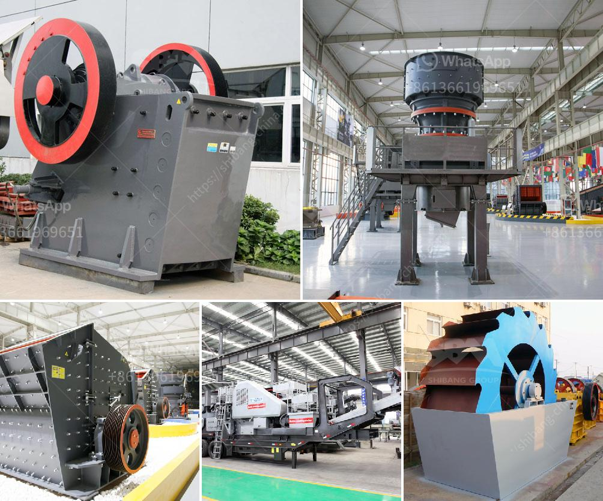

<h3>stone crushing plants of japanese technology</h3>
Stone crushing plants are used for crushing large stones and rocks into smaller particles for construction purposes. These plants consist of different types of crushers, screens, conveyors, and feeders that are used to crush the stones into specific sizes. The increasing demand for construction materials has led to the development of advanced crushing plants using Japanese technology.

Japanese technology in the field of crushing plants has revolutionized the industry by introducing innovative equipment and efficient systems. These plants are designed to provide high productivity, durability, and reliability. The technology used in stone crushing plants helps increase operational efficiency and lower production costs.

One of the key features of Japanese technology in crushing plants is the ability to produce locally sourced materials, thereby reducing transportation costs and dependency on imported aggregates. These plants are designed to handle different types of materials, such as granite, basalt, limestone, and river stone. They can also process recycled concrete and asphalt for reuse in construction projects.

The crushers used in Japanese stone crushing plants are designed to produce a consistent and high-quality end product. Jaw crushers, cone crushers, and impact crushers are commonly used in these plants. The feed material is crushed by highly intensive forces applied by the rotating jaws of the crushers. This process results in the production of aggregates with precise shapes and sizes.

In addition to crushers, Japanese stone crushing plants also feature screens and conveyors. Screens are used to separate the crushed materials into different sizes. Vibrating screens are commonly used in these plants to efficiently separate the materials based on their sizes. Conveyors, on the other hand, are used to transport the crushed materials from one stage of the crushing process to another.

Japanese technology has also focused on the automation of stone crushing plants. These plants are equipped with advanced control systems that allow operators to monitor and control the entire crushing process from a centralized control room. This automation helps in optimizing the performance of the plant and reducing human error.

The incorporation of Japanese technology in stone crushing plants has made them environmentally friendly. These plants are equipped with dust suppression systems that minimize the emission of dust particles into the atmosphere. Additionally, noise reduction measures are implemented to minimize the impact on nearby residents.

Japanese stone crushing plants have gained popularity globally due to their advanced technology and efficient operations. These plants are widely used in various construction projects, including highways, bridges, railways, airports, and buildings. The high-quality aggregates produced by these plants contribute to the strength and durability of concrete structures.

In conclusion, stone crushing plants utilizing Japanese technology have revolutionized the industry by introducing advanced equipment and systems. These plants are designed to produce high-quality aggregates for construction purposes efficiently. The incorporation of Japanese technology has resulted in increased productivity, durability, and environmental friendliness in the stone crushing industry.
<h3>Contact us</h3><ul><li><strong>Whatsapp:&nbsp;<a href="https://wa.me/8613661969651">+8613661969651</a></strong></li><li><a href="https://swt.shibang-china.com/?git&amp;zhl&amp;stone crushing plants of japanese technology"><strong>Online Service(chat now)</strong></a></li></ul><h3>Related</h3><ul><li><a href='rock crusher supplier.md'>rock crusher supplier</a></li><li><a href='impact coal crusher.md'>impact coal crusher</a></li><li><a href='sample business plan for gold mine.md'>sample business plan for gold mine</a></li><li><a href='river stone crusher for sale.md'>river stone crusher for sale</a></li><li><a href='granite grinding mill.md'>granite grinding mill</a></li></ul>