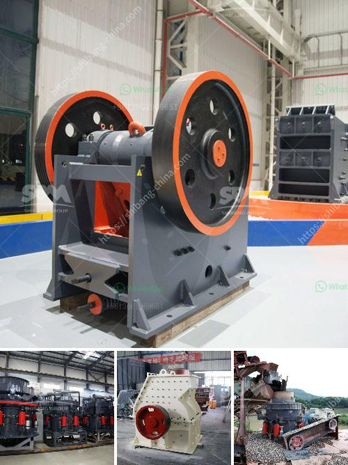

<h3>stone cutting machine in india</h3>
India, with its rich history of stone architecture, is no stranger to the art of stone cutting. For centuries, skilled craftsmen would meticulously carve and shape stones using traditional tools, resulting in stunning architectural masterpieces. However, with technological advancements, the introduction of stone cutting machines has revolutionized the construction industry in India, making it faster, more efficient, and precise.

Stone cutting machines are powered equipment designed specifically to cut, shape, and polish stones with minimal human intervention. These machines come in various sizes and types, each catering to different cutting needs. The introduction of stone cutting machines in India has significantly altered the way stones are processed and utilized in construction projects.

One of the key advantages of using stone cutting machines is the increased speed and efficiency of the cutting process. Traditional stone cutting methods required hours of manual labor to achieve precision cuts and intricate designs. Stone cutting machines, on the other hand, can perform the same tasks in a fraction of the time, significantly reducing the overall project time. This not only improves productivity but also allows construction projects to be completed ahead of schedule, saving costs and resources.

Precision is another major benefit of stone cutting machines. These machines utilize advanced technology and computer-aided mechanisms to ensure accuracy in every cut. The measurements can be programmed into the machine, eliminating the risk of human error. As a result, the stones are cut with meticulous precision, fitting perfectly into the desired spaces. This level of accuracy is crucial for large-scale construction projects, where even a slight deviation can lead to costly reworks and compromised structural integrity.

Moreover, stone cutting machines have increased the range of stone shapes and designs that can be achieved. These machines come with various cutting heads and attachments, allowing craftsmen to create intricate patterns, beveled edges, and custom shapes that were previously challenging or impossible to achieve manually. This versatility has expanded the design possibilities in both modern and traditional architecture and has opened up a new realm of creative possibilities for architects, designers, and craftsmen.

In addition to the aforementioned benefits, stone cutting machines have also contributed to worker safety and decreased labor costs. The manual cutting and shaping of stones are highly labor-intensive tasks, often requiring workers to exert physical effort for extended periods. By automating these processes, stone cutting machines reduce the risk of worker fatigue, injuries, and related health issues. Moreover, the reduced labor requirement can significantly lower construction costs, making projects more economically feasible.

The construction industry in India has readily embraced the use of stone cutting machines, recognizing the numerous advantages they offer. The availability of these machines in the market has increased competitiveness among construction companies, as they strive to stay up-to-date with the latest technology. Simultaneously, the demand for skilled technicians who can operate and maintain these machines has also risen, creating job opportunities and growth in the sector.

In conclusion, the introduction of stone cutting machines in India has transformed the construction industry, making it more efficient, precise, and cost-effective. The increased speed, accuracy, and versatility of these machines have revolutionized the way stones are processed and utilized in construction projects. As technology continues to advance, we can expect further innovations in stone cutting machines, propelling the industry towards new levels of excellence and creativity.
<h3>Contact us</h3><ul><li><strong>Whatsapp:&nbsp;<a href="https://wa.me/8613661969651">+8613661969651</a></strong></li><li><a href="https://swt.shibang-china.com/?git&amp;zhl&amp;stone cutting machine in india"><strong>Online Service(chat now)</strong></a></li></ul><h3>Related</h3><ul><li><a href='stone for stone mill.md'>stone for stone mill</a></li><li><a href='stone crushing plant sale.md'>stone crushing plant sale</a></li><li><a href='coal screening plant.md'>coal screening plant</a></li><li><a href='ball mill construction.md'>ball mill construction</a></li><li><a href='200tph stationary crushing plant.md'>200tph stationary crushing plant</a></li></ul>