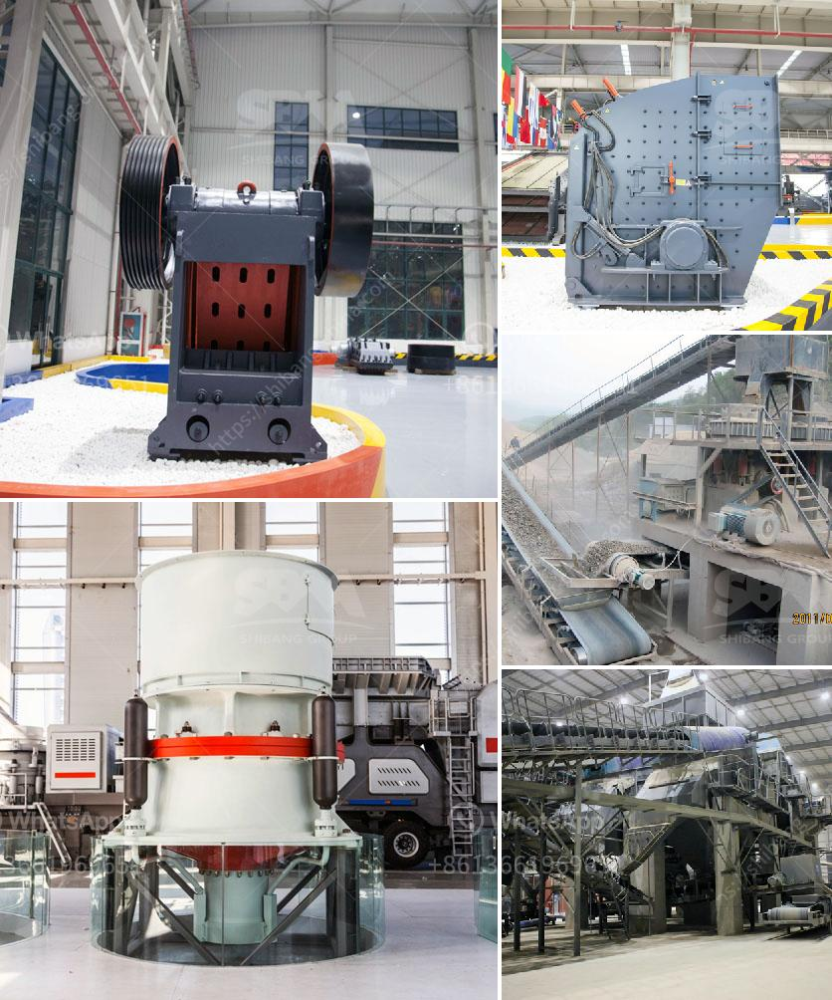

<h3>stone equipment hammer mill philippines</h3>
The Stone Equipment Hammer Mill is a powerful and versatile tool that is perfect for contractors and DIY enthusiasts alike. It has a rugged construction and a reliable performance, making it a great investment for anyone who needs to crush rocks or finely grind materials.

The hammer mill is designed to crush or grind various types of materials, such as grains, building materials, chemical industry, metallurgy, fodder, and many others. It operates on the principle of impact, where the hammers strike the feed material and drive it against the breaker plate. The crushed material then falls through the screen and exits the mill.

One of the main advantages of the Stone Equipment Hammer Mill is its versatility. It can be used for a wide range of applications, from crushing rocks for landscaping purposes to grinding grains for animal feed. This makes it an essential tool for farmers, contractors, and hobbyists who need to process materials in various ways.

The hammer mill is also known for its efficiency and time-saving capabilities. It has a high production capacity and can process large volumes of material in a short amount of time. This is especially important for businesses that need to crush or grind materials on a regular basis, as it helps to increase productivity and reduce operational costs.

Furthermore, the hammer mill is easy to operate and maintain. It comes with a user-friendly interface that allows operators to adjust the settings and control the output size of the crushed material. The machine also has a built-in safety feature to prevent accidents and ensure the well-being of the operators.

In addition to its excellent performance, the Stone Equipment Hammer Mill is also known for its durability. It is made from high-quality materials that are designed to withstand heavy use and harsh conditions. This ensures that the machine will last for a long time, even under constant and demanding use.

If you are in the construction, agriculture, or manufacturing industry in the Philippines, the Stone Equipment Hammer Mill is a must-have tool. Its powerful performance, versatility, and efficiency make it a great investment that will help you save time and money in the long run.

Overall, the Stone Equipment Hammer Mill is a reliable and efficient tool that is perfect for various applications. Whether you need to crush rocks or grind materials, this machine will get the job done. Its durability and ease of use make it a great investment for anyone in need of a reliable and versatile tool.
<h3>Contact us</h3><ul><li><strong>Whatsapp:&nbsp;<a href="https://wa.me/8613661969651">+8613661969651</a></strong></li><li><a href="https://swt.shibang-china.com/?git&amp;zhl&amp;stone equipment hammer mill philippines"><strong>Online Service(chat now)</strong></a></li></ul><h3>Related</h3><ul><li><a href='aggregates for concrete crusher in nigeria.md'>aggregates for concrete crusher in nigeria</a></li><li><a href='equipment used in limestone mining.md'>equipment used in limestone mining</a></li><li><a href='gypsum fertilizer granulator for sale.md'>gypsum fertilizer granulator for sale</a></li><li><a href='smallest cement plant.md'>smallest cement plant</a></li><li><a href='hot used trommel screen machine in sand.md'>hot used trommel screen machine in sand</a></li></ul>