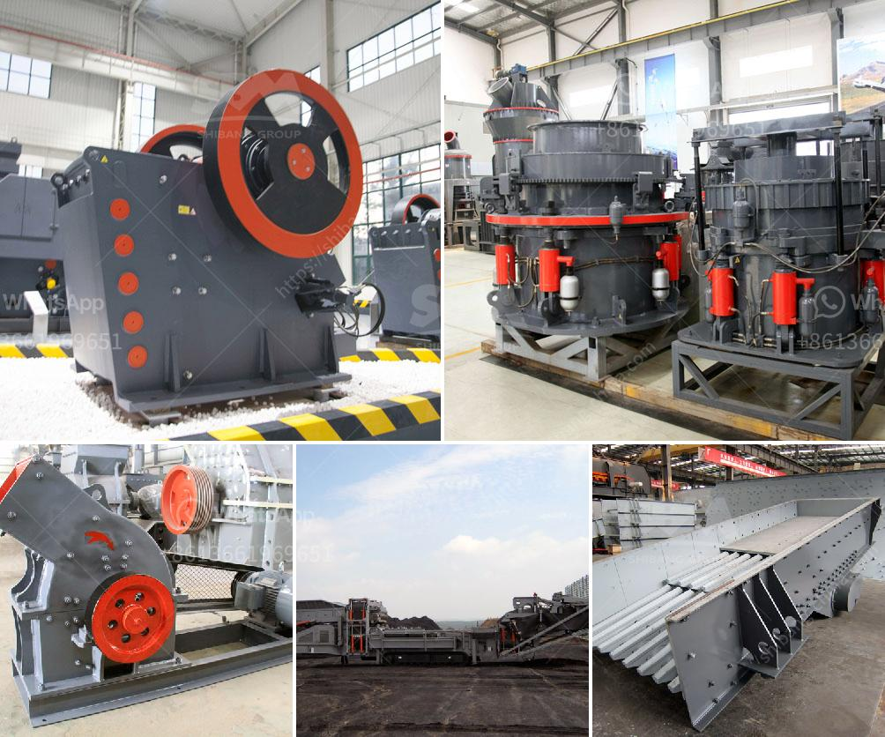

<h3>stone for stone mill</h3>
Stone mills have been used for centuries to grind grains into flour, and for good reason. These sturdy and reliable machines are able to produce high-quality flour that is packed with nutrients, all thanks to the power of stones.

The use of stones in the milling process dates back to ancient times, where they were essential tools for grinding grains. The traditional stone mill consists of two circular stones, with the top stone (known as the runner) rotating against the stationary bottom stone (known as the bedstone). As the grains are fed into the mill, the stones crush and grind them, gradually turning them into fine flour.

One of the key advantages of a stone mill is its ability to preserve the nutritional value of the grains. Unlike modern steel mills, which generate heat that can destroy vital nutrients, stone mills operate at lower temperatures, ensuring that the essential vitamins, minerals, and fibers are retained in the flour. This means that stone milled flour not only tastes better but also provides a healthier option for consumers.

Furthermore, the use of stones in the milling process contributes to the overall quality and flavor of the flour. The grinding action of the stones creates a uniform particle size, resulting in a flour that is consistent in texture and taste. Stone milled flour is often valued for its superior baking qualities, producing breads and pastries with a delightful texture and flavor that cannot be achieved with commercially processed flour.

In addition to its functional benefits, stone mills also hold a certain charm and aesthetic appeal. The sight of these traditional machines, with their gracefully turning wheels and timeless design, evokes a sense of nostalgia and connects us with our agricultural heritage. Stone mills are not only utilitarian tools but also symbols of tradition and craftsmanship, reminding us of simpler times when local communities relied on the milling process to meet their daily needs.

In conclusion, stone mills offer a host of advantages that make them desirable for those seeking high-quality, nutritious flour. Their ability to preserve the nutritional value of grains, produce consistent and flavorful flour, and evoke a sense of tradition make them an excellent choice for both commercial and home bakers. So, whether you are a professional baker looking to enhance your products or a home cook longing for the taste of authentic, stone-ground flour, a stone mill is a worthwhile investment.
<h3>Contact us</h3><ul><li><strong>Whatsapp:&nbsp;<a href="https://wa.me/8613661969651">+8613661969651</a></strong></li><li><a href="https://swt.shibang-china.com/?git&amp;zhl&amp;stone for stone mill"><strong>Online Service(chat now)</strong></a></li></ul><h3>Related</h3><ul><li><a href='high efficient grinding mills for sale.md'>high efficient grinding mills for sale</a></li><li><a href='professional boulder crusher manufacturer.md'>professional boulder crusher manufacturer</a></li><li><a href='conveyor belts for sand for sale.md'>conveyor belts for sand for sale</a></li><li><a href='grinding machine for bentonite.md'>grinding machine for bentonite</a></li><li><a href='diagram of a typical hammer mill.md'>diagram of a typical hammer mill</a></li></ul>